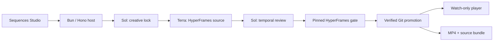

# Sequences architecture

Sequences is a Codex-powered motion director for SaaS launch videos, built
natively on HyperFrames. A user supplies one brief, clicks Generate, watches
the verified composition in Sequences Studio, and renders an MP4 plus source
bundle on request.

Running code and the pinned HyperFrames contract are authoritative. This
document describes the current product path and its ownership boundaries.

## Product boundary

Sequences owns:

- creative direction and the semantic story contract;
- fresh Codex workflow custody and bounded repair;
- project isolation, policy, verification evidence, and Git promotion;
- the watch-only Studio experience;
- soundtrack/SFX direction and final delivery.

HyperFrames owns:

- the HTML composition contract and timeline runtime;
- player playback, seeking, timed media, and scene discovery;
- lint, strict browser QA, snapshots, and rendering primitives;
- composition variables, registry components, and SDK mechanisms.

Sequences does not rebuild a video runtime or a full nonlinear editor. The
primary product remains one prompt to one original, verified launch film.

## System map

The browser is intentionally thin. Trusted orchestration, file access, Codex
processes, verification, promotion, and rendering remain on the loopback host.

## The generation pipeline and its failure owners

Every Generate starts from the accepted project and creates a fresh isolated
candidate. Each stage has one owner so any defect can be repaired without
turning the host into a second creative director.

| Stage            | Responsibility                                                                                                   | Owner                     | Durable evidence                                            |
| ---------------- | ---------------------------------------------------------------------------------------------------------------- | ------------------------- | ----------------------------------------------------------- |
| Prepare          | Checkpoint accepted state, create candidate worktree, install the neutral SaaS shell and verified skills         | Host + Git                | candidate manifest                                          |
| Creative lock    | Choose concept, story beats, component states, motion direction, and sound plan                                  | Sol                       | `frame.md`, design capsule, component plan, `sequence.json` |
| Composition      | Build the real HTML/CSS/GSAP HyperFrames source                                                                  | Terra                     | composition files and `index.motion.json`                   |
| Policy           | Derive the artifact inventory from Git; enforce paths, sizes, symlinks, local assets, and protected-skill hashes | Host                      | candidate diff                                              |
| Semantic gate    | Validate timing, transitions, entities, camera intent, component bindings, and motion assertions                 | Host                      | parsed semantic artifacts                                   |
| Temporal audit   | Review ordered frames and landed states without mutating source                                                  | Sol                       | temporal evidence and audit result                          |
| HyperFrames gate | Run pinned lint and strict browser checks, including snapshots, layout, contrast, transitions, and motion        | HyperFrames + host        | QA evidence                                                 |
| Bounded repair   | Return one localized finding to its source owner; adopt only an objectively improving change                     | Terra or category fixer   | transactional repair evidence                               |
| Promote          | Commit the candidate and fast-forward the accepted project                                                       | Git custody               | commit and patches                                          |
| Preview          | Bundle accepted source and expose synchronized timed media in Studio                                             | Host + HyperFrames player | accepted preview URL                                        |
| Render           | Freeze the promoted commit, render, mux directed audio, inspect the encoded result, and expose downloads         | Host + HyperFrames        | MP4 and source ZIP                                          |

Per-generation diagnostics live under `data/`. They are operator-local runtime
state, ignored by Git, and not part of the public repository. Product completion
and promotion always come from disk and Git truth rather than a model's
self-report.

## Agent workflow and model routing

`SEQUENCES_AGENT_WORKFLOW=balanced` is the production default:

1. Sol / medium locks design, story, component states, motion intent, and audio
   direction.
2. Terra / medium owns renderable source.
3. Sol / medium performs a read-only temporal audit of the painted result.
4. If needed, one focused polish returns to the exact Terra thread.
5. The complete semantic and strict-QA gates run before promotion.

The stages are sequential because cancellation custody currently owns one Codex
subprocess per job. `SEQUENCES_AGENT_WORKFLOW=legacy` keeps Luna as an all-in-one
controlled baseline. Every new generation receives a fresh thread; only bounded
repair within that generation may resume it.

## Result contracts

The workflow creates ordinary source plus a small set of typed artifacts:

- `frame.md` — design direction;
- `story/design-capsule.json` — palette, typography, visual rules, and source
  bindings;
- `story/component-plan.json` — reusable product surfaces, parts, states, and
  beat bindings;
- `sequence.json` — format, causal beats, transitions, entities, camera intent,
  and semantic audio cues;
- `index.motion.json` — machine-testable motion expectations;
- `index.html` and `compositions/**` — the renderable HyperFrames project.

Fresh candidates begin without `index.motion.json`. Its presence, the semantic
artifacts, and a real Git diff are disk-level completion evidence.

## HyperFrames composition boundary

A project has one root composition with stable `data-composition-id`,
`data-width`, and `data-height` attributes. Timed clips use `class="clip"` plus
`data-start`, `data-duration`, and `data-track-index`. Sub-compositions mount
through `data-composition-src` and own paused, seek-safe timelines.

Important integration rules:

- stable identity is required across semantic artifacts and DOM;
- one composition owns each visible element and pointer;
- animation must be deterministic under arbitrary seeking;
- media belongs inside the composition tree and uses HyperFrames timing;
- authored source uses local assets only;
- the host may repair objective invalidity, never subjective taste.

### Sharp edges

- The runtime needs exact composition IDs and timeline registration.
- Mount the player before assigning its preview source so warm-cache readiness
  events cannot win a race.
- Sub-composition roots are flattened; selectors must address runtime DOM.
- Transform-based motion is safer than layout-property tweens.
- Pointer coordinates must include active camera transforms.
- Readable transitions need explicit landed holds.
- Timed audio must follow the animation playhead.

## Verification and repair

The host verifies in layers:

1. Zod schemas validate persisted and authored contracts.
2. Git policy validates the actual candidate inventory.
3. HyperFrames lint validates structure and timelines.
4. Strict browser QA checks runtime, assets, layout, contrast, motion, and
   transition frames.
5. The temporal audit reviews ordered painted frames and event landings.
6. Delivery checks the encoded MP4 with ffprobe and decoded boundary frames.

Deterministic repair is category-owned and transactional. A repair is kept only
when its target category improves and no other category regresses. Creative
weakness returns to the compositor with evidence and a narrow budget.

## Audio custody

The director selects one catalog soundtrack and bounded semantic SFX cues in
`sequence.json`. It never supplies arbitrary file paths or FFmpeg filters.

The host verifies vendored audio hashes; owns gain, fades, cue timing, looping,
limiting, and AAC muxing; and injects the same directed tracks into Studio
preview HTML using HyperFrames timed-media attributes. Preview and rendered
delivery therefore share one semantic sound direction.

## Git, persistence, and security

The accepted project is a managed Git repository. Each candidate is an isolated
worktree based on the accepted commit. Promotion requires passing contracts and
QA before moving accepted HEAD.

Security is loopback-only:

- exact Host and Origin checks;
- short-lived local session plus CSRF protection;
- signed, range-capable project and audio routes;
- opaque sandboxing for generated composition HTML;
- protected local paths and browser-servable type allowlists.

Generated candidates, diagnostics, workbench files, logs, and render scratch
space remain ignored. The public repository contains source, fixtures, skills,
verified Showcase finals, and judge-useful evidence.

## Showcase curriculum and provenance

The five films in `Showcase/` were made through Sequences using Codex and the
HyperFrames skill set:

- Slack Ad;
- ChatGPT Ad;
- ChatGPT Native Story;
- Sequences Recommendation Ad;
- Sequences Abstract Ad.

They are finished pipeline examples. The author-context gateway exposes at most
two compact, hash-pinned Showcase capsules selected from the prompt and
`sequence.json`. Full videos and unrelated source never enter model context.

The smaller `demos/` projects provide implementation grammar used by the pinned
skills. Superseded diagnostics and local reference footage are excluded from
the judge-facing tree.

## Planned motion toolkit

New capability should arrive as a narrow helper, component, or validator around
the existing HyperFrames contract:

1. geometry, safe-area, fit, and placement primitives;
2. proportional-font typewriter and caret measurement;
3. pointer approach, settle, press, ripple, release, and consequence;
4. camera framing solved from semantic focal entities;
5. path and morph compatibility checks;
6. transition families with velocity continuity;
7. music phrase and cue-safe timing helpers;
8. event clips and composed temporal contact sheets.

Candidate-local typewriter and pointer primitives already ship in the SaaS
starter shell. Future items must prove a visible improvement before expanding
the core host.

## Current scope

| Area       | Current hackathon surface                                                                      |
| ---------- | ---------------------------------------------------------------------------------------------- |
| Generation | Fresh Sol/Terra/Sol or Luna workflow, isolated candidate, automatic verified promotion         |
| Inputs     | Prompt plus up to four local product screenshots                                               |
| Motion     | Native HTML/CSS/SVG, GSAP timelines, sub-compositions, interaction primitives                  |
| Audio      | Catalog-directed soundtrack and SFX in preview and render                                      |
| Studio     | Prompt, live progress, Featured examples, Recent results, watch-only timeline, render/download |
| Delivery   | Local judge path, verified MP4, and source bundle                                              |

The focused build intentionally excludes a full NLE, multi-project
collaboration, public candidate decisions, and a HyperFrames Studio wrapper.

## Hackathon boundary

Sequences for Slack was the pre-hackathon research system. This repository is a
ground-up web product with a separate Git history, local Bun/Hono host,
fresh-run GPT-5.6 workflow, HyperFrames 0.7.56, and a new delivery surface.
The prior system supplied product learning, not application code or runtime
dependencies. The full dated boundary is documented in `README.md`.

## Testing contract

| Change           | Verification                                           |
| ---------------- | ------------------------------------------------------ |
| Markdown only    | `bun x oxfmt --check <changed.md>`                     |
| TypeScript       | `bun run typecheck` plus focused Vitest                |
| Client or build  | `bun run build`                                        |
| Foundation       | `bun run doctor` and `bun run test:project`            |
| Prepared fixture | `bun run qa:fixture`                                   |
| Phase gates      | `bun run test:phase -- 0` or `bun run test:phase -- 1` |
| Full exit gate   | `bun run test:all`                                     |
| Judge path       | `bun run judge`                                        |
| Website parity   | `bun run probe:website -- --check-ui`                  |

`bun run judge` is the canonical first command after cloning. It performs
offline bootstrap, environment checks, production build, server/session smoke,
and the prepared composition route without spending a model generation.

## Extension principle

Creative knowledge should ship as a small extension pack rather than enlarging
the core director. A pack needs a stable ID, compact principles, selectively
readable examples, known sharp edges, and a visible verification artifact. It
is promoted only when the active author path can use it and the output shows a
material gain.
