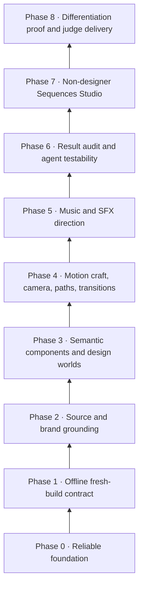
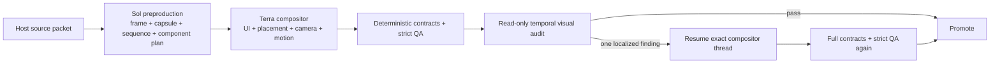

# Sequences architecture

Sequences is a motion-design AI for SaaS launch videos, built natively on HyperFrames. One prompt, one Generate click, one fresh director run, and a server-verified launch film lands directly on the Sequences timeline — then renders and downloads on request.

This document is the single architecture reference. It absorbs the former `HYPERFRAMES.md` (platform capability boundary), `REPORT_SLACK_SEQUENCES.md` (predecessor retrospective), and `OPENAI_HACKATHON_PLAN.md` (early MVP guide); those files are retired. Running code and the pinned HyperFrames contract remain authoritative for current behavior; this document is the map, the plan, and the memory.

## North star

> Prompt, click Generate, watch a fresh Luna run work, and receive a server-verified SaaS launch film directly on the Sequences timeline — then render and download it when ready.

The end goal is a system that is **more robust, faster, and less error-prone than Slack Sequences while producing visibly better motion design**. Timeline editing, hand-tuning, and revision flows are secondary; the primary product is one prompt → generate → excellent video. The differentiator must be visible in the output: a new internal method, detector, or skill counts as progress only when a user receives a better result or a safer workflow.

The quality bar is concrete: the hand-authored golden Slack demo (`C:\dev\Coding\Sequences\apps\slack\demo-output\slack-ad-luna\slack-ad-luna-with-audio.mp4`, source in `apps/slack/demos/slack-ad/`). Seven causal acts, measured geometry, typewriters whose carets ride the text edge, camera math solved from focal points, one energy peak, deliberate read holds, and a breathing final lockup — in roughly 618 hand-written lines. Generated output must move toward that bar, not toward "technically valid HTML."

## The stack



Each phase has one shippable result, a phase test with durable receipts, explicit non-goals, and an exit gate. A phase is a capability boundary, not permanent file ownership: later code may call lower phases; lower phases must not know about higher product features. New creative knowledge normally arrives as extension packs, not new core phases.

## Rules that apply to every phase

1. **Everything produces a result.** A command yields a visible artifact, a receipt, or a clearly owned failure.
2. **The model owns taste; the host owns truth.** The host validates schema, paths, hashes, runtime safety, and output existence. It never silently rewrites creative timing, camera direction, or hierarchy. This was Slack Sequences' best boundary and its most instructive violation.
3. **Disk truth beats model claims.** A structured model response is a claim. Completion, artifact inventories, and promotion decisions are derived from the filesystem and the Git diff, never from what the model says it did.
4. **Use HyperFrames before extending HyperFrames.** Reuse the pinned player, runtime, skills, diagnostics, and renderer. Registry or SDK capabilities count only when the active profile actually supplies them.
5. **Stable identity is non-negotiable.** Beats, entities, source facts, components, and editable DOM elements retain durable IDs.
6. **One finding has one owner.** A defect cannot trigger several competing detectors or repair passes.
7. **Fix classes, not specimens.** Reproduce a failure offline, identify its owning contract, fix the shared cause, add one regression, and remove superseded exceptions. A paid probe confirms a class fix; it must never be the discovery mechanism for the next branch of a repair tree.
8. **No taste normalizers.** Objective invalidity may be repaired by the host; subjective weakness returns to the director with evidence.
9. **Small defects share one quality budget.** Weird morphs, double cursors, reset flickers, stray lines, and weak landings are individually advisory but collectively rejecting.
10. **Plan sound before choreography when sound matters.** Music is not a last-minute media attachment.
11. **The judge path is a product path.** No key, terminal, or local configuration should be required to inspect and download the prepared result.
12. **Every Generate is fresh.** A new generation gets a new scaffold and a new director thread. Only bounded QA repair inside that exact run may resume its thread.
13. **Quarantine is not a product decision.** Candidate worktrees isolate unverified output; passing output is promoted by the server without public Apply/Reject controls.

## The generation pipeline and its failure owners

This is the heart of Phase 1. Every run moves through named stages; every stage has one owner, one failure code family, and durable evidence under `data/runs/release-a/<run_id>/`. When a run fails, the receipt tells you which stage owned it — fix that stage, never the whole pipeline.

| Stage                  | What happens                                                                                                                                                                                                                                                                                                                                                                                                                        | Owner          | Typical failure codes                                    | Evidence                                                       |
| ---------------------- | ----------------------------------------------------------------------------------------------------------------------------------------------------------------------------------------------------------------------------------------------------------------------------------------------------------------------------------------------------------------------------------------------------------------------------------- | -------------- | -------------------------------------------------------- | -------------------------------------------------------------- |
| `queued` → `preparing` | Accepted state checkpointed; fresh candidate worktree created; SaaS starter shell installed; skills copied and hash-verified                                                                                                                                                                                                                                                                                                        | server / git   | `stale_base`, `git_candidate_failed`, `candidate_exists` | `manifest.json`, `prompt.json`                                 |
| `authoring`            | One fresh Codex/Luna thread authors in the candidate; progress streamed; structured final captured                                                                                                                                                                                                                                                                                                                                  | codex          | `codex_authoring_failed`, `codex_timed_out`              | `codex.jsonl`, `stderr.log`, `final.json`                      |
| Post-author policy     | Git diff is the authoritative artifact inventory; allowlist, size, symlink, and external-asset checks; skill hashes reverified and skills removed                                                                                                                                                                                                                                                                                   | policy         | `candidate_policy_failed`, `protected_skills_changed`    | receipt `changedFiles`                                         |
| Semantic contract      | `sequence.json` and `index.motion.json` parsed and validated: beats, transitions per boundary, camera timing, motion assertions per beat                                                                                                                                                                                                                                                                                            | policy         | `semantic_contract_failed`                               | `sequence.json`, `index.motion.json` in candidate              |
| Host normalization     | Deterministic, category-owned fixups on fresh builds only: composition-root attributes, clip-signature markers, GSAP selector scoping/lifecycle/transform conflicts, font fallbacks, readable pointer-events, root asset paths                                                                                                                                                                                                      | server         | (throws into `job_failed` if broken)                     | candidate diff                                                 |
| `verifying`            | Pinned HyperFrames `lint` then strict `check` with snapshots, transition samples, frame checks, contrast; layout clusters built and adjudicated with renderer-backed inspection                                                                                                                                                                                                                                                     | hyperframes    | `hyperframes_verification_failed`                        | `qa/attempt-N/{lint,check,qa}.json`, `qa/attempt-N/snapshots/` |
| Bounded repair         | Deterministic category fixers (contrast with cross-pass background memory; lint-endorsed tween-overlap `overwrite:"auto"`), run before and again after ≤3 same-thread layout-repair turns (cluster-batched, evidence images, proof-frame comparison); one final same-thread polish turn when only warnings remain. Every pass is transactional: adopt on strict category improvement with no other regression, else restore exactly | server + codex | recorded per-attempt, not terminal                       | `qa-remediation`, `layout-repair/attempt-N/`, `turns/`         |
| `applying` → `applied` | Candidate commit, forward/inverse patches, fast-forward promotion of accepted HEAD; timeline updates                                                                                                                                                                                                                                                                                                                                | git            | `stale_base`                                             | `changes.patch`, `changes.inverse.patch`                       |
| Render (on request)    | Host-owned render job freezes the promoted commit, renders, ffprobes, decodes boundary frames, exposes MP4 + source ZIP                                                                                                                                                                                                                                                                                                             | server         | render receipt states                                    | `artifacts/renders/release-a/`                                 |

Working rules for this pipeline:

- A failed run is a **diagnosis packet**, not a dead end: state, error code, owner, and stage artifacts are always present. Start at `receipt.json`, follow `error.owner` to the stage, open that stage's artifacts.
- Repairs are transactional. A repair attempt that does not strictly improve its category, that regresses another category, or that changes a declared-unchanged proof frame is restored exactly.
- The three-attempt caps are hard. A candidate that cannot pass within bounded repair fails honestly; the answer is a class-level fix offline, not a fourth attempt.

### July 2026 reliability record

Sixty-one live runs before July 16 broke down as: 24 × `hyperframes_verification_failed`, 10 × `codex_authoring_failed`, 6 × `semantic_contract_failed`, 3 × `stale_base`, 2 × `git_candidate_failed`, 2 × `server_restarted`, 2 × `job_failed`, 1 × `codex_timed_out`, 4 cancelled — and only ~7 applied. The July 16 focused sprint (runs `run_5f6a962a` FormPilot pass, `run_ae7821ec` RouteKit infra failure, `run_c46785e6` Pulseboard QA failure) ended at 1 strict pass of 3 required probes.

Four class-level fixes landed on July 16 in response (the last two were found by same-day probes on the new pipeline):

1. **Disk-truth completion (authoring stage).** The host previously armed a 60-second quiet-kill window as soon as the model _claimed_ `sequence.json` in a structured message. An eager "I'm writing the plan" checkpoint plus a long silent reasoning stretch meant the host killed the CLI mid-thought, the kill was masked as exit 0, and the run died later at an empty Git diff ("Codex exited without changing any project files" — the entire OrbitCRM/Shipnote/ClarityOps "author non-delivery" cluster). A fresh build's final now counts as completion only when `sequence.json` **and** `index.motion.json` actually exist in the candidate worktree. The scaffold deliberately ships no `index.motion.json`, so its presence is filesystem-level proof of authoring.
2. **Null means absent (semantic-contract stage).** The author contract teaches null-for-absent (`"camera": null`, `"revision": null`), yet the sequence schema rejected an explicit `null` on optional fields — a live Luna probe authored a complete, well-structured 22-second five-beat film and the whole run failed because plain cuts carried `"outgoingEntityId": null`. Optional authored fields now accept `null` as absent (normalized to undefined); semantic requirements (match-cut/morph anchors) still reject genuinely missing entities. Representation quibbles must never consume a paid run.
3. **The SaaS starter shell (preparing stage).** The fresh scaffold was a nearly blank technical root, so every run re-invented the entire HTML/CSS foundation — the leading source of layout QA failures and non-deliveries. Fresh candidates now start from `fixtures/saas-shell/`: a generic, contract-valid host composition plus a neutral product-world sub-composition (headline lockup, product window with chrome/sidebar/stats/chart/activity, brand tokens as CSS variables, exactly one pointer owner, registered paused timelines). The shell also carries candidate-local `compositions/_primitives/` typewriter and pointer-action helpers with copyable examples; no network fetch or manual asset copy is needed. The shell passes the pinned strict check on its own — 46/46 contrast samples, zero layout findings — so a run's QA debt is only what Luna adds or changes. Luna rebrands through tokens, rewrites all starter copy, and choreographs stable regions instead of rebuilding from nothing; shipping the unmodified shell is an explicit hard failure.
4. **Clip-signature normalization (host normalization stage).** A live probe authored six correct timed sections — direct children of the composition root with `data-start`, `data-duration`, and `data-track-index` — and hard-failed lint solely because `class="clip"` was missing. That marker has exactly one right answer when the full timing signature is present, so `ensureFreshClipClasses` now adds it deterministically (composition roots excluded, sub-composition hosts included). Verified against the failed specimen: lint went from six errors to clean.

A second wave of fixes landed later on July 16 from the first post-foundation user run (`run_34c0fb68`), which died with zero blocking findings and three residual warnings:

5. **Tween-overlap fixer (bounded repair stage).** The pinned lint flags same-target/same-property tweens whose windows touch — including the classic press/release pair meeting at one instant — and strict mode blocks on any warning, but no repair category owned the finding (it recurred across Luna, Sol, and the user's run). Lint's own fix hint accepts `overwrite: "auto"` on the later tween, which was empirically verified to silence the finding without changing authored timing; `TweenOverlapFixer` now applies exactly that, transactionally.
6. **Cross-pass contrast memory (bounded repair stage).** An element that crossfades over two backgrounds is sampled against only one per QA attempt; the contrast fixer would fix pass 1's background, then "fix" pass 2's and re-break the first, oscillating until the budget ran out. Later passes now union every background already proven for a selector, escalating to the plate strategy when no single color can satisfy them all. The deterministic pass also reruns after layout repairs, because an adopted creative repair can expose new contrast debt.
7. **Bounded author polish turn (new final stage).** When strict QA still fails with zero errors, zero unresolved clusters, and only warnings, one bounded turn on the same director thread receives the verbatim findings (for example readable text crossfading through a transition sample — a defect only the author may fix). Adoption is transactional under a full re-verify; a non-improving turn is restored exactly. This closes the "no blocking findings, but required checks did not pass" dead end.

Probe rounds on July 16 surfaced and closed four more classes:

8. **Repair-context fitting (context gateway).** A rich authored sequence plus a 19-finding set plus an inspection packet overflowed the 64 KiB scoped-context cap during repair-context preparation and killed an otherwise repairable run. The gateway now fits its budget by construction with a fixed trimming precedence: drop the inspection packet, compact findings (whitelisted fields, truncated prose), then compact the sequence to contract fields. A context overflow can no longer be fatal.
9. **Rationale is documentation, not validity (semantic contract).** A probe authored a complete film and failed because one plain cut omitted the transition `rationale` string. Optional-in-spirit prose fields no longer hard-fail the artifact; identity anchors for match-cuts/morphs remain required.
10. **Semantic motion-selector reconciliation (host normalization).** Trellis run `run_1915354a` exposed a valid wordmark as `data-hf-id="trellis-wordmark"` while its motion sidecar addressed `#trellis-wordmark`; the browser sampler correctly found no matching CSS id and failed the run. The sidecar normalizer now resolves simple `appearsBy`, `before`, and `staysInFrame` id claims to the actual DOM id or `data-hf-id` selector. Rechecking a temporary copy of the exact candidate reduced `motion_selector_missing` from one to zero without altering the preserved run evidence.
11. **Multi-property tween-overlap parsing (bounded repair stage).** The tween fixer parsed `for scale between ...` but silently skipped the equally valid HyperFrames finding shape `for x, y between ...`, so the Trellis pointer conflict received no deterministic pass. The parser now accepts and records comma-separated property lists; on the exact candidate it applied one `overwrite: "auto"` repair and the pinned strict check reduced `overlapping_gsap_tweens` from one to zero.

A July 17 audio-directed probe (`run_38eb9d57`, Forma) closed one more class:

12. **Composition self-attribute selectors (host normalization).** The director scoped a sub-composition's own styles with its own `[data-composition-id="product-world"]` attribute — 152 `composition_self_attribute_selector` lint warnings, which strict mode blocks. The lint fix hint names the one right answer (the root's unique `#id`), so `normalizeFreshCompositionSelfSelectors` now owns it: it rewrites only self-references inside the declaring file to the root `#id` (deriving the conventional `<composition-id>-root` id when the root has none and it is globally unused), never touching cross-composition references. On the exact candidate lint went 152 → 0 and the whole strict check reduced to only genuine layout-overflow findings. This also unpoisons repair adoption: a ±1 fluctuation in a 152-warning mass had been vetoing layout repairs that fixed every real error.

13. **Reference images are specifications, not screenshot planes (component contract).** The hand-polished ChatGPT native-story control showed that moving uploaded screenshots through a camera could satisfy file-use bookkeeping while producing a weak, flat product film. Reference-derived plans now bind each image to a native DOM state root with `data-reference-image` and `data-reference-mode="recreated"`; using the uploaded path as a rendered `src` is rejected. The five finished Showcase controls remain evidence and inspiration, not candidate scaffolds.

The remaining dominant class — layout overlap/overflow during authored motion — is a craft problem, addressed by the starter shell now and by the Phase 4 motion primitives below later. The Forma probe confirms it is still the live wall: with the self-selector mass removed, that run's residue was exactly 15 `container_overflow`/`text_box_overflow`/`content_overlap` findings.

## HyperFrames: the platform boundary

**Pinned baseline:** HyperFrames `0.7.56` everywhere (packages, CLI, vendored reference), with the six-skill `sequences-saas-launch-local-v1` author profile. Public HyperFrames docs may describe capabilities this repository does not install; the pinned versions and running code win.

| HyperFrames owns                                                                         | Sequences owns                                                    |
| ---------------------------------------------------------------------------------------- | ----------------------------------------------------------------- |
| Timed HTML composition and deterministic frame capture                                   | Fresh creative direction and semantic result intent               |
| Player, editing SDK, stable element targets, patches, undo/redo                          | A Sequences-owned watch-only Studio now; safe editing later       |
| Clips, tracks, variables, sub-compositions, media playback                               | Beats, claims, entities, sources, transitions, camera intent      |
| GSAP, Lottie, Three.js, Anime.js, CSS, WAAPI, WebGL/WebGPU                               | Commercial taste, continuity, camera ownership, source fidelity   |
| Lint, runtime/layout/contrast checks, snapshots, motion assertions, keyframe diagnostics | Event-level review, temporal evidence, cumulative polish judgment |
| Local/cloud rendering and publishing                                                     | Judge-ready viewing and one-click result delivery                 |

Sequences is not "HyperFrames with a smaller timeline." The wedge is a HyperFrames-native creative director that turns a fresh prompt into a coherent SaaS film, makes the work visible, and places a verified result directly on a Sequences-owned timeline.

### The composition contract

HyperFrames renders an HTML document by seeking it to exact timestamps; the same time and inputs must always produce the same pixels.

- The root has a unique `data-composition-id`, explicit pixel width/height, and a positive duration source.
- Visible timed elements are direct children of the composition root with `class="clip"`, `data-start`, `data-duration`, `data-track-index` (never the deprecated `data-layer`).
- Exactly one paused GSAP timeline is registered at `window.__timelines[compositionId]`; the key matches the root ID.
- Sub-compositions load through a host clip (`data-composition-src`); their styles, markup, and scripts live inside `<template>`; host/template/timeline IDs match exactly.
- `<video>`/`<audio>` are direct children of the host root; HyperFrames owns playback and seeking.
- Editable elements keep stable `data-hf-id` identity; all assembled DOM IDs are unique.
- Required assets are local before render; render-time network requests are forbidden.
- No wall-clock state, unseeded randomness, infinite repeats, hover/scroll state, async-created timelines, or unregistered animation loops.
- Build the readable static hero state first; animate around it afterward.

The compact semantic artifacts — `sequence.json` (format, exact beat timing, roles, claims, entities, source IDs, semantic transitions, camera intent, music anchors, proof times, implementation files) and `index.motion.json` (executable arrival/order/in-frame/liveness assertions) — describe meaning and proof. They must never mirror DOM/CSS/tweens into a second renderer DSL; HyperFrames HTML remains the only rendering model.

### The author profile

The host installs the hash-pinned `sequences-saas-launch-local-v1` profile into each isolated candidate: `hyperframes` (routing), `hyperframes-core` (composition contract), `hyperframes-creative` (design direction), `hyperframes-animation` (motion rules and adapters), `hyperframes-keyframes` (seek-safe poses/paths/morphs), and `sequences-saas-launch` (the SaaS story overlay). Luna receives a compact catalog and reads only the relevant copied files; it cannot update skills, install registry items, use the network, or assume runtimes the host did not supply (no Three.js, shaders, or premium plugins in the current profile). The host verifies profile hashes before and after authoring and removes the bundle before commit.

Runtime choice inside the current profile: GSAP for nearly all DOM choreography; bundled fonts and CSS for everything visual. Three.js, TypeGPU/WebGPU, Lottie, and shader transitions are future profile-supplied options — do not author against them until a profile supplies and verifies them.

### QA truth and its limits

- `lint`: static composition mistakes, timing/track conflicts, timeline registration.
- `check --strict --snapshots --at-transitions --frame-check`: runtime errors, failed assets, held overlap/occlusion/overflow, motion-sidecar assertions, frame bounds, WCAG contrast.
- `snapshot` / `keyframes` / `animation-map` / `compare`: visual proof without a full render.

These are necessary but not sufficient. They cannot judge a weird morph, a semantically wrong camera move, a two-owner cursor, a purposeless line, a weak landing, or five small defects compounding. That is Sequences review territory (Phase 6) and the reason for the shared polish budget.

### Sharp edges (learned the expensive way)

- Root sizing failures can collapse valid layout and escape static checks; a full-screen fill on the composition root can render black — use a full-bleed child.
- Media nested inside wrappers or sub-compositions can render blank while checks look healthy; duplicate IDs across assembled sub-compositions cause blank media.
- `data-layout-allow-*` markers are detector escape hatches, not semantic proof. Sequences strips them in a disposable detector pass and accepts them only against an exact entity-level `overlapIntents` declaration; root/scene/composition-level markers are rejected.
- GSAP: never declare CSS transforms on elements whose transforms GSAP animates; a persistent surface enters once (`fromTo` entrance, then `to()`); create timelines with `defaults:{overwrite:"auto"}`; scope non-ID selectors to their composition root.
- Readable-state handoffs are atomic: one GSAP set swaps outgoing/incoming state layers; never crossfade two complete readable text layers.
- `staysInFrame` must target readable product UI, never the intentionally overscanned world/camera wrapper.
- A green QA receipt is not a taste verdict. Look at the painted pixels.
- Skills and public docs advance independently of the pinned runtime. Upgrade as one tested profile, never ad hoc inside a run.

### Before building a "new" capability

1. Does the pinned player, SDK, CLI, registry, or a routable workflow already provide the mechanism?
2. Is the proposed work visibly better for the user, or only internally different?
3. Can Sequences add intent/evidence around the existing mechanism instead of replacing it?
4. What same-input result and focused test will prove the improvement?

If the honest answer is "we implemented our own version," do not build it.

## Model routing

The legacy director model is configurable per server launch:
`SEQUENCES_CODEX_MODEL` (default `gpt-5.6-luna`) and
`SEQUENCES_CODEX_EFFORT` (default `high`). The production default is
`SEQUENCES_AGENT_WORKFLOW=balanced`; legacy remains available for comparison.
Balanced has strict
per-role routes (`SEQUENCES_CREATIVE_*`, `SEQUENCES_COMPONENT_*`,
`SEQUENCES_COMPOSITOR_*`, and `SEQUENCES_AUDITOR_*`). Every actual turn, not
only the top-level run, records role, operation, model, effort, thread,
duration, total token categories, and cached-input tokens.

Current policy:

- **GPT-5.6 Luna / high** remains the controlled single-director baseline for a
  complete build (story, design, implementation, motion).
- Bounded repair resumes the **same** thread and model that owns renderable
  source — Luna in legacy mode, the compositor in balanced mode.
- Sol and Terra are probe alternatives. Run comparisons through `bun run generate` against a server launched with the override, and judge on: authored-file completeness, first-pass strict QA, repair convergence, and — above all — the rendered result. A model earns a routing role (for example storyboard vs implementation vs repair) only through repeated same-prompt evidence, never through a single lucky run.
- Balanced is separable ownership, not a voting committee: one Sol/medium
  preproduction turn locks creative direction and component architecture;
  Terra/medium composes; deterministic QA runs; then a read-only Sol/medium
  visual audit may request one bounded compositor polish. The merged
  preproduction turn removes the slow standalone component-model round trip.

### Workflow V2 balanced custody



The existing candidate contracts are the handoffs; balanced mode does not add a
second design or motion language. One preproduction turn exclusively writes
`frame.md`, `story/design-capsule.json`, `sequence.json`, and
`story/component-plan.json`; their bytes are hash-locked. The compositor is the
sole writer of HTML/CSS/JS, derived assets, and `index.motion.json`. Any
attempted auditor mutation is transactionally restored.

Strict QA produces rendered snapshots. The host binds those pixels to a typed
`workflow/temporal-evidence.json` packet derived from beat proof/hold times,
transition pre/mid/landed phases, camera arrival/settle/hold intent, and
`sequence.audio.cues`. Typing cues reserve start/mid/end evidence; mouse-click
cues reserve approach/contact/immediate-consequence evidence before generic
fill, all clamped to the owning beat and the 40-frame packet limit. Transit
frames are labeled so the auditor judges motion continuity without mistaking an
intentional pan for a failed landing. The auditor can emit only
`workflow/visual-audit.json`; it cannot suppress deterministic findings. One
bounded audit polish may edit compositor-owned paths and is adopted only after
all locks, semantic contracts, motion contracts, and the complete strict QA
gate pass again.

This first implementation is sequential. The current process-cancellation map
owns one Codex subprocess per job; parallel fan-out stays disabled until each
concurrent process can be cancelled and ledgered independently. This preserves
correct custody while evaluation establishes whether the extra turns justify
their latency and uncached token cost.

### July 16 same-prompt probe evidence (one run each, Meridian brief, new pipeline)

| Model                                     | Structure authored                                                                                                                                     | Outcome                                                                                                                                                                                                                | Distance from passing                  | Craft signal                                                                                                          |
| ----------------------------------------- | ------------------------------------------------------------------------------------------------------------------------------------------------------ | ---------------------------------------------------------------------------------------------------------------------------------------------------------------------------------------------------------------------- | -------------------------------------- | --------------------------------------------------------------------------------------------------------------------- |
| gpt-5.6-luna / high                       | 5 beats in the shell's product world, entity-anchored match cuts, 22s                                                                                  | Failed on the (since-fixed) null-vs-absent contract quibble; offline strict check: 1 text-clip cluster + 1 over-strict self-authored `keepsMoving`                                                                     | ~1 bounded repair                      | Disciplined, contract-faithful, visually sparser                                                                      |
| gpt-5.6-sol / high                        | 5 beats across 3 authored compositions, 4 match cuts, full rebrand (custom mark, warm palette, orbital lockup)                                         | Survived 1 contrast remediation + 1 adopted layout repair; blocked by a single `overlapping_gsap_tweens` strict warning                                                                                                | 1 warning                              | Richest art direction and content density of the three                                                                |
| gpt-5.6-terra / high                      | 5 beats, 1 world composition, cameras on 2 beats, 4 transition kinds (match-cut/morph/pan/dissolve)                                                    | Failed semantic contract: camera `arrival` 0.25s before its beat (timed to lead the incoming pan)                                                                                                                      | 1 declaration fix                      | Most cinematic ambition; layout/motion/contrast all clean offline, 1 lint error (`fontSize` tween)                    |
| gpt-5.6-luna / high (rerun)               | 6 timed zones in one authored world, richer than its first attempt                                                                                     | Failed lint solely on missing `class="clip"` markers — now fixed by `ensureFreshClipClasses`; with the normalizer applied offline, only 2 overlap errors + 2 contrast warnings remain (both bounded-repair categories) | 1 normalizer (landed) + bounded repair | Improved density on second exposure to the shell                                                                      |
| gpt-5.6-luna / high (3rd, all fixes live) | Full pipeline exercised: clip normalization, 1 contrast remediation, 3 bounded repair turns, 5 QA attempts                                             | Failed on its own over-strict `keepsMoving` assertion (subject enters at 3.3s, assertion demands motion from 0s) plus one tween-overlap warning; repairs were correctly rejected for regressing non-layout categories  | Prompt-contract fix (landed)           | Second occurrence of the self-assertion class, so the author contract now requires assertions satisfiable from time 0 |
| gpt-5.6-luna / high (4th)                 | Cleanest run yet: no lint/layout/contrast/assertion failures except one `fontSize` tween on the proof counter                                          | Failed on the same layout-property tween class Terra hit — author contract now forbids tweening layout properties                                                                                                      | Prompt-contract fix (landed)           | Funnel narrowed to a single craft rule                                                                                |
| gpt-5.6-luna / high (5th)                 | 1 adopted layout repair, then blocked by `keepsMoving` scoped to the sub-composition root (identity consumed at mount) + a 0.02s pointer tween overlap | Both classes fixed: sidecar normalizer drops unmountable keepsMoving scopes; contract now requires non-overlapping sequential tweens                                                                                   | Normalizer + contract (landed)         | Template-root selectors are a provable dead class                                                                     |
| gpt-5.6-luna / high (6th)                 | Authoring was proceeding through file changes                                                                                                          | Upstream "Selected model is at capacity" after 8 minutes — transient provider failure, now surfaced verbatim in the receipt                                                                                            | Retry or route to Sol                  | Not a foundation defect                                                                                               |

A July 16 effort probe (same pipeline, Lumen brief, gpt-5.6-luna / **medium**) settled the effort question for the legacy all-in-one route: medium authored a low-contrast dark theme with **55 contrast errors** (high-effort runs produced ~7 findings), consumed two adopted contrast passes (52 selector fixes), one adopted layout repair, and a correctly rejected trailing pass — and still failed with 44 errors. Lower effort remains a false economy for the legacy director. Balanced uses medium only for narrower role-owned turns and must be judged independently. The run also live-exercised every new remediation path, including the transactional restore, with no pipeline defects.

Read: with the starter shell, every model produced a branded multi-beat product world, and every failure was one small craft or declaration detail — the wall moved from infrastructure to final craft. Preliminary routing hypothesis (needs repetition before acting): Sol for visual richness, Terra for camera ambition, Luna for contract discipline. Two follow-up classes are visible: (a) semantic-contract failures could get one bounded same-thread repair turn — the thread exists and the fix is usually a one-line JSON edit; (b) strict-blocking warnings with no repair category (`overlapping_gsap_tweens`) currently fail runs without any repair attempt.

## Phase status

### Phase 0 — Reliable foundation — **complete**

The full loop is real: doctor (23 checks), browserless project smoke, isolated Git quarantine, hash-pinned skills, pinned HyperFrames QA, category-owned contrast repair, automatic promotion, host-owned render with ffprobe/boundary-frame verification, and MP4 + source-bundle downloads. `bun run test:phase -- 0` gates it; the automated gate and `test:all` passed July 14, 2026.

### Phase 1 — Offline fresh-build contract — **offline gate met; live website gate still required**

Everything structural is implemented: fresh scaffold + thread per Generate, the compact `sequence.json`/`index.motion.json` contract, honest streamed progress, watch-only Studio/timeline, host verification with bounded same-thread repair, and server-owned promotion. What is not met is the live acceptance bar: **three independent 20–24 second prompts, at most one author call + one strict QA pass + one composition-class repair each, at least two passing without manual intervention.**

The July 16 session's class fixes (disk-truth completion, null-means-absent, SaaS starter shell, clip-signature normalization, satisfiable-assertion contract) target exactly the failure classes that kept the gate closed. The next move is unchanged: rerun the three-prompt gate on the new foundation. Do not begin Phase 2 or add editing until it passes.

**Production constraints:** legacy stays one fresh director per generation;
the default balanced route uses disjoint specialist ownership rather than a
voting committee. Neither route continues a prior generation. No public revisions or
candidate decisions, no official HyperFrames Studio, no giant prompt, no
incident-specific repair ladder, and no second rendering DSL.

### Phase 2 — Source and brand grounding — **open; image-intake foundation implemented**

Prompt + image upload is implemented: up to four PNG/JPEG/WebP references are decoded at trusted intake, hashed with dimensions, copied immutably into each candidate, and bound in the authored component/design contracts. Website URL via HyperFrames capture and GitHub/PR remain later routes. Load-bearing claim/source IDs and explicit creative-status handling remain open.

### Phase 3 — Semantic components and design worlds — **open; contract foundation implemented**

Fresh builds now require a director-owned root `frame.md`, machine-readable `story/design-capsule.json`, and `story/component-plan.json` v2. The host verifies catalog claims or bespoke/reference provenance, contrast, exact bundled fonts, CSS-token use, typed `data-component` roots, real nested parts/states, semantic beat/entity bindings, and at least one persistent component across the causal product story. Four design foundations are starting points, not host-selected taste. Invokable transition recipes and reusable micro-assets remain open; see "Semantic components and invokable transitions" below.

### Phase 4 — Motion craft, camera, paths, and transitions — first interaction primitives landed July 20, 2026

The first candidate-local slice is live: a proportional-font-safe typewriter with deterministic glyph/caret states and a measured system-pointer action with approach, settle, press, ripple, release, consequence, and audio markers. Camera compilers, generalized paths, morph compatibility, and transition-velocity checks remain open; see "The planned motion toolkit" below.

### Phase 5 — Music and SFX direction — foundation landed July 17, 2026 (adoption-queue item 1)

The custody model, vendored catalog with deterministic beat analysis, `sequence.json` `audio` contract, and host-owned FFmpeg mux are live (see the adoption queue below). Still open for the full phase: narration as a separate host-known track, cue-safe windows derived from the beat map, and binding beats to musical phrases at story-lock time rather than as authoring guidance. Slack Sequences proved the custody model (`audioContract.ts`) and the creative failure (music chosen by story, synchronization "not required").

### Phase 6 — Result audit and agent testability — temporal-audit foundation implemented

Workflow V2 now turns strict-QA snapshots into typed temporal evidence, labels
transit versus landed phases, prioritizes typing/click event frames, runs a
read-only visual audit, and can return one localized finding to the exact
compositor thread under transactional QA. Still open: composed contact sheets,
dedicated event clips around every cut/morph/landing, the complete owned defect vocabulary, and
terminal-usable tools (`inspect_sequence`, `snapshot`, `temporal_strip`,
`render_event_clip`, `compare_states`, `read_qa_findings`). The exit gate keeps
the go/no-go comparison: stock HyperFrames vs Sequences on the same brief must
show a visible win before more Studio UI is built.

### Phase 7 — Non-designer Sequences Studio — not started

Semantic-first timeline (beats, claims, sources, music anchors), a small real inspector on `@hyperframes/sdk` patches with undo, and the polished judge path. Not an NLE, not a HyperFrames Studio wrapper.

### Phase 8 — Differentiation proof and judge delivery — not started

Blind comparison (2-of-3 reviewers, 4-of-6 quality dimensions), hardened no-key hosted delivery, sub-three-minute submission story, honest provenance.

## The planned motion toolkit (Phase 4 design; interaction foundation partially built)

These are the capabilities that turn mechanism into craft. The typewriter and pointer-action primitives are the first small implementation; the architecture reserves the remaining seams so adding them later does not reopen the foundation. Each arrives as a local helper, small compiler, or validator around semantic artifacts plus renderer-backed evidence — never as a second animation engine.

1. **Geometry, fit, safe-area, and placement primitives.** A typed spatial vocabulary for load-bearing entities: safe zones (title/action-safe insets), anchors, containment, reserved camera headroom, and intentional-overlap declarations, keyed by beat and entity/part ID. The host already measures rendered boxes (layout inspector); this layer gives Luna the same vocabulary at authoring time so placement is declared, checkable intent instead of emergent CSS. Hard failures stay limited to objective cases (declared focal off-frame, unreadable, or hidden at its landing); density and taste stay advisory.
2. **One-owner camera intent compiler.** `sequence.json` already records camera owner, target, poses, and arrival/settle/hold timing. The compiler turns that intent into the implementation pattern (padded inner world inside a clipped viewport, transform-based pushes, solved focal math like the golden demo's `camAt`), and validates the single-camera rule: one world transform or one real 3D camera per beat, never competing pseudo-cameras; entry/exit velocity continuity across camera cuts; angled/ghost proof for depth shots.
3. **Identity-aware match cuts and morphs.** Match-cut and morph transitions already require outgoing/incoming entity IDs. The added layer checks geometry compatibility (aspect, scale delta, silhouette) before authoring and verifies subject continuity in rendered evidence after — no morphs between incompatible shapes, no teleporting subjects, FLIP/shared-element only when the same semantic entity persists.
4. **Typed interaction and path choreography — first primitives landed.** `compositions/_primitives/typewriter.js` derives visible grapheme prefixes from time while adjacent inline layout keeps its caret after proportional text. `pointer-action.js` resolves a normal arrow's declared hotspot from target-relative, root-local geometry and drives one seek-safe approach → settle → press/ripple → release → consequence state machine with no competing press/release tweens. General curve/path tooling and target-visibility validation remain open.
5. **Transition velocity and landing-hold checks.** Outgoing/incoming velocity matching when a cut implies continuous motion; a minimum readable hold after every primary landing (the golden demo's read-hold discipline); rejection of unjustified crossfades and dead frames at boundaries. Enforced as renderer-backed event checks around each declared transition, feeding the shared polish budget.

The bounded reference-learning slice is also live: five Showcase capsules are hash-pinned inside `sequences-saas-launch`, each with a compact lesson/mistake summary, one contact sheet, and two or three focused source files. Prompt plus `sequence.json` deterministically selects at most two into author context and records their IDs in the context receipt; unselected films and full videos never enter the prompt. A generalized catalog or separate plugin system remains intentionally absent.

## Semantic components and invokable transitions (Phase 3 design)

The component model that makes UI worlds editable and motion-capable without another component library:

- **Contract:** every Sequences component has a stable ID, named parts, named states, brand-token bindings, and source bindings. The same parts are visible to Luna (via `sequence.json` entities) and to the future Studio/SDK inspector.
- **States over scenes:** a product surface changes state (`empty → filling → resolved`, `list → detail`) as one persistent DOM subject. State changes are the primary editing and animation unit; scene handoffs preserve entity identity across beats.
- **Invokable transitions:** a component's states declare how they connect — enter/exit/morph recipes (atomic swap, shared-element move, mask reveal, typed input) that a director invokes by name instead of re-deriving GSAP each time. Recipes compile to plain seek-safe GSAP against stable `hf-id` targets; they are authored patterns, not a runtime framework.
- **Reuse order:** browser-native HTML/CSS/SVG first, then a host-approved registry block explicitly bundled into the profile, then a small Sequences semantic component, then an upstream registry contribution only after two real compositions need it.
- The SaaS starter shell is the seed of this system: its stable regions (lockup, window, sidebar, stats, chart, activity, pointer) are the first de facto components. As Phase 3 opens, they graduate from "regions Luna restyles" to typed components with named states and invokable transitions.

## Teaching Luna motion

The first bounded corpus now exists as the five selected Showcase capsules described above, delivered through the existing author-context gateway rather than a model-called tool. Later work may add path preview, camera solve, morph compatibility checks, and more tagged examples. The design rule stands: many examples may exist on disk; only one or two relevant capsules enter context.

## Slack Sequences: what it proved, and what to take

Slack Sequences (`C:\dev\Coding\Sequences`) validated the product idea and much of the infrastructure, and failed on timing: the workflow was shaped around an OpenRouter committee for weeks, then switched to Luna the final day. Its numbers are the cautionary tale — ~72k lines of source and 42k of tests; a 17.5k-line runner; 51 ordered source normalizers; across 157 recorded runs, 2.4–2.9 attempts per stage, 14.9 minutes to first output, prompts up to 137k characters; 34 clean publishes vs 102 degraded and 21 loud failures — while the golden demo it never consistently matched was 618 hand-written lines.

What it proved (adopt):

- **The custody boundary.** Model owns taste, host owns truth; constrained worker execution with schemas, hashes, atomic materialization, and inspectable evidence (`codex-worker/server.mjs`, `worker-lib.mjs`). Already adopted wholesale in the current host.
- **A single capable director.** The Luna/Harborview single-director route produced the most coherent output with the least churn. Adopted as the Phase 1 spine.
- **Runtime verification over HTML validity.** Seek determinism, browser state, temporal landings, render integrity. Adopted and deepened (strict check, motion sidecar, proof frames).
- **Evidence-first failure handling.** Probe logs, attempt ledgers, model-free replay. Adopted as the run ledger and receipts.
- **The golden demo's motion language.** Causal continuity, measured geometry, typed interactions, workspace superzoom with solved camera math, one energy peak, read holds, breathing final lockup. This is the Phase 4 curriculum.

What to take cautiously (mine, don't migrate):

- `audioContract.ts` — sound custody model is right; add beat-aware planning before adopting (Phase 5).
- Studio catalogs/recipes (`studio/INTEGRATION.md`, `studioLibrary.ts`) — good discoverability ideas, but only connected directly to the production author path (Phase 3/7), never as a parallel disconnected system.
- The layout auditor's mechanics (`layout/report.ts`, vendored layout-audit) — detector lessons only; its semantic guesswork (fixed thresholds, manual exemptions, box-vs-meaning gap) is why the current system uses typed clusters, entity-level intent, and renderer-backed adjudication instead.
- Sentinel/replay utilities — deterministic diagnosis is right; rebuild small against current receipts rather than porting.

What to ignore (do not port):

- The committee: concept/storyboard/scaffold/slot-author/critic/repair/rescue orchestration and its provider-coupled prompts, retries, and budgets.
- The incident-repair ladder and the 51-pass normalizer registry — the host-as-co-director failure mode that silently weakened authored choreography.
- The `#stage`/`window.__timeline` custom runtime, bespoke seek/render hacks, giant camera/layout engines, and the generic transition registry — HyperFrames owns these mechanisms now.
- Cross-run thread persistence and four-stage paid repair flows.
- Slack-specific copy, assets, and workspace context plumbing.

### The surgical adoption queue (planned July 16, 2026; items 1, 2, and 4 landed July 17)

Each item is one surgery: port, adapt, test offline, prove with one probe, stop. Never make the old runtime a dependency.

1. **Music and SFX foundation** — **landed July 17, 2026.** The `audioContract.ts` custody model, rewritten as `apps/web/src/server/audio-director.ts`: the director declares `sequence.json` `audio` (one catalog `soundtrackId` + bounded semantic cues: typing window, mouse-click, pop, woosh, notification); the host owns the vendored bytes (`vendor/audio/`, 12 hashed beds + 5 SFX), SHA-256 verification, gain, fades, looping, limiting, and the FFmpeg mux into the rendered MP4 (atomic replace, then ffprobe must report the AAC stream). The donor's skipped piece exists now: `scripts/analyze-audio.ts` computes a one-time deterministic beat/energy map per bed (BPM, beat/bar grid with confidence, per-second energy) stored with the audio hash in `vendor/audio/catalog.json` and exposed compactly through the author context (`audioCatalog`), so beat boundaries can land on musical structure. Audio-plan validation runs inside the aggregated fresh-build contract packet (repairable on the same thread) and again before render. Doctor verifies the catalog hashes. `audio: null` is a deliberate silent film.
2. **Golden-demo motion corpus** — **landed July 17, 2026** as `sequences-saas-launch/references/golden-techniques.md`: measured-geometry-before-motion, the `camAt` focal-point camera solve and the golden camera phrase, caret-riding typewriters (rebuilt on clip-path + transform because the pinned lint forbids layout tweens), the collapse-into-mark energy peak, operated pointer grammar, read-hold discipline, and staging-outside-the-timeline. Summary-first: SKILL.md points to it only when the brief needs those techniques. No `#stage`/`window.__timeline` code was ported.
3. **Brand/screenshot intake (Phase 2 route)** — open. The donor's `/sequences assets` flow: hashed approved images under an inputs ledger plus a deterministic palette/notes brief. Our server already carries `imagePaths` plumbing and image-path validation; add the upload endpoint, provenance records with stable source IDs, and the design-contract derivation. Later, the fingerprint-bound **Luna UI pack** contract (tokens plus component states/parts/morph anchors as a host-validated visual vocabulary) becomes the seed of Phase 3 semantic components and invokable transitions.
4. **Visual evidence in the polish turn** — **landed July 17, 2026.** The bounded residual-QA polish turn now attaches up to three of the failing attempt's own rendered snapshots (`qaSnapshotEvidence`) through the existing evidence-image channel, so residual-warning fixes are made against pixels, not descriptions; the adopted `author_polish` remediation records the exact image artifacts it was shown. Purely additive: with no snapshots the turn proceeds on structured findings alone and records an empty evidence list.
5. **Bounded capability and Showcase capsules — landed July 20, 2026.** `capability-selector` exposes concise prompt/sequence-selected implementation references; typing and click selections point directly at the candidate-local primitives. The same bounded author context selects at most two of the five hash-pinned Showcase capsules and records the selection in `ContextReceipt`. No model-called retrieval tool, vector store, marketplace dependency, or bulk source dump was added.

Explicitly staying behind: the committee/ladder and its 51-normalizer registry, the 2,000-line sentinel detector registry (its lessons are already encoded in our typed clusters and one-owner rule), Studio catalogs as wholesale imports, cross-run thread persistence, and all Slack-specific context plumbing.

## Testing contract

```powershell
bun run doctor            # environment, pinned versions, skills, fixture identity
bun run test:project      # browserless server/API/composition smoke
bun run typecheck && bun run test
bun run qa:fixture        # pinned lint + strict check on the release-a fixture
bun run test:phase -- 0   # Phase 0 exit gate
bun run test:phase -- 1   # Phase 1 contract gate (fresh custody, artifacts, promotion)
bun run test:all          # completed-phase regression, run at exit gates only
bun run generate -- "..." # live probe through the real server loop (paid)
```

- During a phase, run that phase's test only; run `test:all` once at the exit gate.
- Use offline fixtures before paid probes whenever a deterministic reproduction is possible. A paid probe confirms a class fix; it does not hunt for the next symptom.
- Every run — pass or fail — writes durable receipts and preserves the smallest useful evidence. Visual phases never claim a visual pass from logs alone.
- The SaaS starter shell has its own offline gate: assemble it with the fixture's technical files and run pinned `lint` + strict `check`; it must stay finding-free on its own so candidate QA debt is exactly what the author added.

### Manual real-Codex acceptance (release check, not automated)

Start `bun run dev`, open the boot-token URL, submit one representative SaaS-launch prompt with the real Codex account, and confirm: honest progress, generated result on the watch-only timeline, run/source commits and changed files visible, passing host QA without sample substitution, then render and download both MP4 and source ZIP. Record run ID, render ID, prompt, reviewer, and limitations in the release evidence.

## Extension packs

Continuous creative work should not enlarge the core director or this document. After the relevant phase exists, a pack ships with: a stable ID and one-sentence purpose; a compact principle/contract file; a catalog of summaries with selectively readable examples; one original fixture composition or event clip; known failure modes and proof times; and `test:pack -- <id>` producing a visible result and receipt. Good candidates: commercial camera moves, match-cut families, UI state transitions, morph compatibility, tactile cursor motion, typography systems, chart/data motion, SFX families, brand frame worlds.

A pack may use any installed HyperFrames capability but must not copy skill implementation docs or modify global author prompts merely to make itself discoverable.

## How to add a future phase

Only add a phase when the capability truly depends on the completed stack and cannot be an extension pack:

```markdown
## Phase N — Name

**One sentence:** The capability boundary.

**Result:** The visible artifact or user outcome.

### Stage N.1 — First constrained stage

- [ ] Work that produces a result.

**Constraints:** What this phase deliberately does not become.

**Phase N test:** One focused command, fixtures, and evidence.

**Exit gate:** Observable acceptance condition; then run test:all.
```

If a proposed phase has no standalone result, no isolated test, or mainly duplicates a HyperFrames mechanism, it is not ready to enter the architecture.
