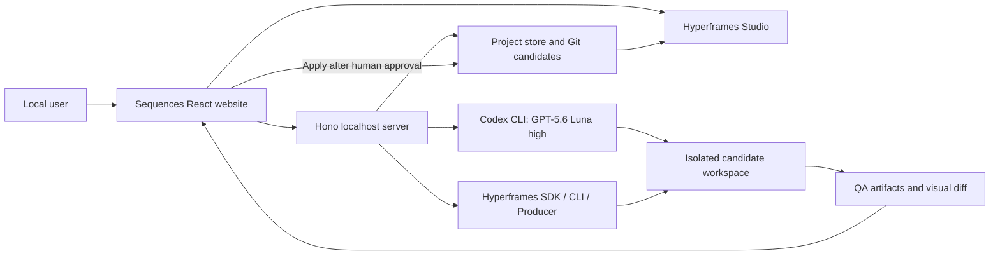

# Sequences for OpenAI Build Week

## Hyperframes-native product strategy, architecture, and phased implementation plan

**Prepared:** July 13, 2026  
**Track:** Work & Productivity  
**Submission deadline:** July 21, 2026 at 5:00 PM Pacific / 8:00 PM Toronto  
**Recommended code freeze:** July 20 at 6:00 PM Toronto  
**Recommended submission target:** July 21 at 12:00 PM Toronto  
**Primary runtime:** local website + Codex CLI + GPT-5.6 Luna at high reasoning  
**Creative foundation:** Hyperframes 0.7.56  
**Status:** implementation source of truth. The [official rules](https://openai.devpost.com/rules) and current event website always take precedence.

---

# Human-friendly summary

## The big rethink

We should not rebuild Slack Sequences in a browser. We should also not build another generic prompt-to-video tool. Hera and Motion already cover large parts of prompt-based launch videos, screenshots, editable motion, and chat iteration.

The new product is:

> **Sequences is a local release-motion workspace that turns approved product evidence into an editable Hyperframes story, then makes every AI change inspectable, testable, and reversible.**

A founder, product marketer, product manager, or customer-success lead can:

1. paste a product website URL;
2. add screenshots and UI states;
3. add a few release facts;
4. choose a curated product-story preset;
5. let Codex with GPT-5.6 Luna/high plan and build a Hyperframes sequence;
6. inspect and edit it in the real Hyperframes Studio timeline;
7. audit motion, claims, runtime behavior, and render quality;
8. request a revision against a selected component or scene;
9. compare the candidate with the accepted version before applying it; and
10. export a deterministic video with a receipt showing what changed and what passed.

The core promise is:

> **Every claim has evidence. Every component has an identity. Every AI revision is a candidate, never a silent overwrite.**

## Why Hyperframes is the foundation

Hyperframes already contains the difficult creative infrastructure we should have used instead of growing the Slack pipeline:

- a full Studio/NLE with timeline, inspector, manual editing, selection, keyframes, and undo;
- an embeddable player using the same composition runtime;
- a headless SDK with stable `data-hf-id` element identities, typed edits, batches, forward patches, and inverse patches;
- deterministic browser checks, snapshots, keyframe inventories, onion shots, and motion assertions;
- a Producer and CLI render path for MP4 and other formats;
- website capture, registry blocks/components, creative presets, and 20 progressively retrievable skills;
- selection context that can tell the agent exactly which element, source file, and time the user selected.

Therefore Sequences should **not** own another renderer, JSON timeline, keyframe engine, source parser, Studio catalog, or undo system. Hyperframes HTML and assets are the creative source of truth. Sequences is the product and trust layer around them:

- intake and evidence;
- claim approval and staleness;
- project and revision isolation;
- Codex job orchestration and visible progress;
- preset curation;
- component-level morph workflows;
- deterministic QA aggregation;
- candidate comparison, approval, rollback, and replay receipts.

This also gives the hackathon a credible open-source enhancement story: Hyperframes is a capable motion engine; Sequences adds a focused workflow for teams who need to create and safely maintain release communication.

## What the three-minute demo should prove

Use an owned fictional SaaS fixture so every screenshot, logo, claim, and piece of music is ours or properly licensed.

1. Open on the polished final 15-20 second video.
2. Click the animated proof component. Show its stable Hyperframes identity, supporting screenshot crop, approved claim, source hash, and exact timeline interval.
3. Start a new project by pasting the fixture URL, adding two before/after UI screenshots, and entering three facts. Deliberately include one unsupported fact and show that it is not approved.
4. Choose a **Feature Release** preset. Show which pinned Hyperframes skills, frame preset, registry blocks, and QA rules it will use.
5. Generate a short plan with Codex and GPT-5.6 Luna/high. Approve the storyboard and visual direction before the expensive build.
6. Show an honestly accelerated recording of the bounded build job: skill retrieval, three disjoint scene files, assembly, checks, and a review-ready candidate. Keep the real elapsed time visible.
7. Open the candidate in Hyperframes Studio. Scrub the real timeline, move one keyframe, undo it, and select a UI card.
8. Request: “Morph this card into the result state and keep the other scenes unchanged.” Show the selected `hfId`, allowed file/range, before/after onion strip, source diff, and QA report.
9. Apply the candidate. Show a receipt such as: `Scene 2 only; 2 files changed; Scenes 1 and 3 unchanged; strict check passed; draft render passed`.
10. Replace one evidence screenshot. Show that only its dependent claim and scene become stale, then generate a targeted patch rather than regenerating the film.
11. Export the final MP4 and reveal the Codex development trail, tests, pinned model/settings, pinned skills, and Build Week commits.

That demonstration is substantially more specific than “prompt in, video out.” It proves product understanding, human control, creative quality, technical depth, and a real maintenance workflow.

## How this is different from Hera.video and Motion.so

We should not claim that competitors cannot edit elements, use screenshots, maintain context, or update scenes. Their current public materials already cover much of that baseline. Hera positions itself around editable AI motion graphics and product launch/UI-animation workflows. Motion positions itself as one agent that researches, builds, and lets users edit or chat against finished scenes.

Sequences wins on a different combination:

| Category baseline | Sequences proof in the demo |
| --- | --- |
| Prompt, URL, or screenshots to a product video | Generation begins from approved evidence and an explicit claim ledger |
| Chat or element-level editing | A request is anchored to the selected Hyperframes `hfId`, source file, scene, and interval |
| Scene regeneration or checkpoints | Every AI run is an isolated Git candidate with a visible source/visual diff and atomic Apply/Reject |
| Timeline/keyframe editing | The actual Hyperframes Studio is the editor; Sequences does not hide a toy timeline behind AI |
| Templates and styles | Presets are inspectable bundles of Hyperframes frame presets, skills, registry components, story constraints, and QA rules |
| Generic UI animation | Shared product components preserve identity and morph between real before/after UI states with proof frames |
| Context-aware generation | URL and screenshots remain linked to claims and scenes; changed evidence marks only dependents stale |
| “Looks good” review | Structured runtime, layout, contrast, motion, determinism, and encoded-video evidence accompany human approval |
| Hosted black-box generation | A local, source-visible workspace using open Hyperframes compositions and the user’s authenticated Codex CLI |

The concise positioning line is:

> **Hera and Motion help create videos. Sequences helps a product team create, verify, revise, and maintain a release story as the product changes.**

## What Slack Sequences taught us

The Slack refactor evidence is not anecdotal. Across 157 recorded runs it observed roughly 14.9 minutes to tier-1, prompts up to 137k characters, 10.2 physical requests per clean run, 7,359 normalizations, and outcomes of 34 published, 102 published-degraded, and 21 fail-loud. The source is the frozen Slack plan at `C:\dev\Coding\Sequences\apps\slack\REFACTOR_PLAN.md`.

| What went wrong | Rule for OpenAI Sequences |
| --- | --- |
| Planner, author, critic, audit, and repair stages multiplied latency and failure surfaces. | Initial creation has only two explicit user-visible jobs: Plan, then Build. A revision is one job. No automatic critic or repair cascade. |
| The model sent whole HTML/CSS/JS artifacts through envelopes and normalizers. | Codex works directly in an isolated Hyperframes project. Completion is verified from disk, Git diff, and Hyperframes checks, not a giant transport envelope. |
| Provider routing moved from OpenRouter to Luna but the pipeline remained complicated. | One provider path only: the locally authenticated Codex CLI with the exact configured GPT-5.6 model. No OpenRouter and no hidden model fallback. |
| Long-lived agent context accumulated stale assumptions and could fail late. | Each Plan, Build, Audit, or Revision is a fresh ephemeral Codex job with compact current state and pinned project-local skills. Files are the memory. |
| A missing wrapper field could discard otherwise complete work. | The host trusts exit code + final schema + expected files + diff allowlist + deterministic gates. Text saying “done” is never sufficient. |
| Raw bundle generation made selectors, IDs, assets, and scripts fragile integration points. | Hyperframes owns composition conventions and stable `data-hf-id` identity. Scene files are modular and each worker has one file owner. |
| Thousands of normalizations silently changed creative intent. | Do not silently rewrite generated motion. Reject the candidate with exact findings or let the user create a scoped revision. |
| Taste checks became hard blockers before the browser had evaluated the work. | Runtime, safety, determinism, and measurable composition rules are hard gates. Taste audits are advisory and require human judgment. |
| Live probes were used to discover deterministic defects and consumed time and credits. | Fixtures, SDK tests, exact replays, and browser gates come first. Live GPT runs are explicit release canaries, never the debugging loop. |
| Motion quality was expected to emerge from prompting. | Hand-author one excellent golden sequence and component morph before connecting Codex. Encode what worked as presets and assertions. |
| The deprecated Studio and custom product semantics drifted apart. | Use current Hyperframes Studio, SDK, player, CLI, and Producer. Do not build or maintain a second editor. |
| Automatic fallback could hide failure. | Failure stays visible. The immutable sample is labeled as a sample and can never silently replace failed generation. |
| Broad feature flags produced multiple owners for the same behavior. | One code path per capability, explicit cuts, and no dormant alternate implementation during the hackathon. |

What we keep from Slack Sequences:

- deterministic time and arbitrary-time seeking;
- state continuity across cuts;
- append-only receipts and stable content hashes;
- exact artifact replays;
- real-browser verification;
- transactional apply/revert;
- failure ownership at the lowest deterministic layer;
- one focal event per beat;
- human review as a real gate rather than decorative approval.

## The eight-day build map

Every phase is cumulative. Each day ends with something observable that can be tested without waiting for later phases.

| Date | Phase | End-of-phase output |
| --- | --- | --- |
| Jul 13 | 0 - Provenance and Hyperframes contract | A clean Build Week baseline, pinned dependencies/skills, green environment doctor, and a proven same-origin Studio integration path |
| Jul 14 | 1 - Manual Hyperframes vertical slice | The local website opens an owned three-scene composition in Studio, selects and edits an element, undoes it, checks it, and renders a draft |
| Jul 15 | 2 - Evidence, presets, and projects | URL/images/facts become a safe evidence pack and approved claim ledger; a preset creates a modular Hyperframes project without AI |
| Jul 16 | 3 - Codex plan and build | GPT-5.6 Luna/high retrieves pinned skills, creates an approved plan, builds a candidate in isolation, and reaches review without touching accepted state |
| Jul 17 | 4 - QA and audit workspace | The product aggregates Hyperframes diagnostics, Sequences audits, snapshots, source diffs, and a draft render into one review gate |
| Jul 18 | 5 - Targeted revision and staleness | A selected element/scene can be revised, compared, applied, rejected, reverted, and selectively invalidated by changed evidence |
| Jul 19 | 6 - Component morph and golden polish | A purposeful shared-component morph, curated presets, final motion polish, deterministic replay, and high-quality export are working |
| Jul 20 | 7 - Judge flow and freeze | A clean machine can run the local judge build and immutable sample; error/cancel paths work; video recording assets are complete |
| Jul 21 | 8 - Submission | Public video, repository, license/notices, README, Codex `/feedback` Session ID, Devpost entry, and final access checks are complete |

## What must ship

- A local website bound to `127.0.0.1`.
- Current Hyperframes Studio as the real editing surface.
- A three-scene, 15-20 second owned sample that looks excellent.
- Public-URL capture only if the network sandbox is proven safe; image upload always works.
- UI image input, release facts, evidence hashes, and an approval ledger.
- Four to six curated product-story presets built from Hyperframes-native assets.
- A visible skill/capability plan derived from the pinned Hyperframes manifests.
- Codex CLI using the exact tested `gpt-5.6-luna` model at high reasoning.
- Explicit Plan and Build jobs with progress, timeout, cancel, receipts, and no hidden retries.
- Candidate isolation, semantic/source/visual diffs, Apply, Reject, Revert, and stale-base protection.
- Element/scene revisions anchored to Hyperframes selection context.
- One excellent component-level morph with proof frames.
- Hyperframes lint/check/keyframe/snapshot/render evidence plus Sequences-specific audits.
- A deterministic replay of an accepted candidate without another model call.
- A one-command judge path and a credential-free immutable sample.
- A versioned downloadable judge test-build bundle linked from the Devpost entry.
- A public narrated YouTube video under three minutes.
- A repository with setup, sample, tests, license, third-party notices, Build Week provenance, and Codex collaboration evidence.

## Survival slice if time turns red

Preserve the differentiated loop, not breadth:

- one owned fixture;
- three scenes;
- one `Feature Release` preset;
- a pasted URL for the owned fixture plus two uploaded screenshots;
- three claims, with one unsupported claim visibly excluded;
- Plan, Build, one selected-component Revision, and no AI audit;
- one shared-element FLIP morph;
- Studio editing, undo, QA, candidate comparison, Apply/Reject/Revert;
- one 16:9 MP4 export;
- exact replay and an immutable sample.

If arbitrary URL capture is not demonstrably safe, disable it and show the owned fixture plus uploaded versioned screenshots. If same-origin Studio embedding is not stable by the Phase 0 stop time, launch the official pinned Studio as the full editor and keep Sequences as the project/review shell. If live Codex is unreliable during judging, the labeled sample and replay path must remain fully testable; never pretend the sample was generated live.

---

# Agent implementation contract

## 1. Authority, boundaries, and non-negotiable decisions

1. This file is the implementation plan. `HACKATHON_RULES.md` is a local convenience copy. The Devpost website and official rules are authoritative.
2. The old repository at `C:\dev\Coding\Sequences` and its GitHub destination are read-only learning sources. Do not modify them, publish from them, or link the new runtime to them.
3. All new judged work belongs in `C:\dev\Coding\Sequences-openai` and must have dated commits after the submission period starts.
4. Hyperframes is the creative foundation. Do not introduce Remotion, a custom renderer, a custom timeline document, a replacement Studio, or a parallel keyframe model.
5. The local website is the product. The authenticated Codex/Hyperframes backend must never be deployed as a public remote service.
6. Use Bun for the Sequences workspace. Hyperframes requires Node.js 22+ semantics and its own current toolchain; document both prerequisites exactly.
7. Runtime Hyperframes packages are pinned exactly to `0.7.56` in the lockfile. No caret, tilde, floating `npx`, auto-upgrade, or network-updated skill bundle is allowed in a job.
8. The requested model is `gpt-5.6-luna` with `model_reasoning_effort="high"`. Phase 0 must prove that exact ID in the installed Codex CLI. Store the real model ID and CLI version in every run receipt.
9. A model never writes accepted state directly. Every model mutation happens in a candidate workspace and requires deterministic verification plus explicit human approval.
10. No automatic model critic, retry ladder, repair agent, provider fallback, or silent sample fallback.
11. Hard gates prove correctness and safety. Taste is a human decision informed by an advisory audit.
12. One excellent golden film and one excellent component morph are required before expanding preset count or adding stretch integrations.

## 2. Official event constraints

### Dates

| Event | Pacific time | Toronto time |
| --- | --- | --- |
| Submission period opens | Jul 13, 2026, 9:00 AM | Jul 13, 12:00 PM |
| Promotional Codex credit request deadline | Jul 17, 2026, 12:00 PM | Jul 17, 3:00 PM |
| Submission deadline | Jul 21, 2026, 5:00 PM | Jul 21, 8:00 PM |
| Judging ends | Aug 5, 2026, 5:00 PM | Aug 5, 8:00 PM |
| Expected winner announcement | Around Aug 12, 2026, 2:00 PM | Around Aug 12, 5:00 PM |

### Required submission evidence

- The project uses Codex and GPT-5.6 in a meaningful, non-trivial way.
- The selected category is **Work & Productivity**.
- The project installs and runs consistently on its stated platform and behaves as depicted.
- Existing work is allowed only when meaningfully extended during the submission period; only new work is judged.
- Prior and new work must be clearly separated with dated commits, Codex logs, or equivalent evidence.
- The demo is a public YouTube video shorter than three minutes, with audio explaining both Codex and GPT-5.6 use.
- The repository is public with relevant licensing, or private and shared with `testing@devpost.com` and `build-week-event@openai.com`.
- The README explains setup, sample data, tests, Codex collaboration, where Codex accelerated work, human decisions, and GPT-5.6 use.
- The Devpost entry includes the `/feedback` Session ID for the Codex task where the majority of core product functionality was built.
- Judges receive a free working project/test build through the end of judging.
- The demo and submission use only content, trademarks, music, fonts, screenshots, code, and data we are authorized to use.
- Open-source use must comply with licenses and the submission must enhance/build on the underlying project.
- No submission changes may be made after the deadline.

### Owner checks that cannot be delegated to code

Before serious implementation, the human entrant must verify:

- Devpost registration and `Join Hackathon` status;
- age, residence, team/representative, conflict-of-interest, and API-supported-country eligibility;
- access to Codex and the requested GPT-5.6 model;
- whether promotional credits are needed before Jul 17 at noon Pacific;
- public vs private repository choice;
- ownership/permission for every demo asset;
- whether any event update changes the requirements in this plan.

## 3. Product definition

### Target user

The launch user is a product marketer or founder at a small SaaS team who ships updates often, has screenshots and release notes, but cannot justify a motion designer for every release. Secondary users are product managers, customer-success leads, and agencies maintaining recurring launch assets.

### Job to be done

> When our product changes, help me turn approved facts and real UI states into a polished release video, let me control the result in a real editor, and update only what changed without losing the rest of the work.

### Problem evidence to collect during the build

The submission should not make unsupported market-size claims. Collect five lightweight interviews or written reactions from target users and record:

- current artifact and workflow;
- time/cost to make a product release video;
- what breaks when screenshots or copy change;
- whether they trust AI-generated claims;
- whether a source-linked, reviewable revision would change adoption;
- which part of the demo they value most.

Summarize themes, not personal data. If interviews cannot be completed, phrase impact as a specific hypothesis and rely on the demonstrated workflow rather than invented numbers.

### Core user-facing objects

- **Project:** accepted Hyperframes source plus its evidence and history.
- **Source:** pasted URL, uploaded image, or pasted release note.
- **Evidence:** immutable captured artifact with provenance and content hash.
- **Claim:** a sentence approved by a human and linked to evidence.
- **Preset:** a versioned bundle of story constraints, frame preset, skills, registry choices, and QA rules.
- **Sequence:** the active Hyperframes composition.
- **Candidate:** isolated proposed changes based on an accepted commit.
- **Revision:** a requested candidate scoped to an element, scene, or explicit global redesign.
- **Audit:** read-only findings with evidence, severity, location, and suggested action.
- **Receipt:** replay data for a run, promotion, revert, audit, or render.

### Primary workflow

```text
Create project
  -> add URL/images/facts
  -> review evidence and approve claims
  -> choose preset
  -> Codex Plan candidate
  -> human approves storyboard/direction
  -> Codex Build candidate
  -> deterministic QA
  -> compare in Studio/player
  -> Apply or Reject
  -> select component/scene
  -> request scoped Revision
  -> QA + compare + Apply/Reject
  -> export + receipt
```

### Required states

Every asynchronous screen must have designed states for:

- empty;
- loading/preparing;
- authoring with real progress;
- waiting for explicit approval;
- verifying;
- review ready;
- stale base;
- failed with owned cause;
- cancelled;
- timed out;
- no selection;
- unsupported/unsafe URL;
- missing environment dependency;
- immutable sample mode;
- offline/replay mode.

### Out of scope for the hackathon

- team accounts, auth, billing, cloud persistence, and collaboration;
- hosted execution of a user’s Codex credentials;
- Slack, Linear, GitHub, Figma, or CMS integrations;
- arbitrary private/authenticated website capture;
- generative voice, music, avatars, or third-party media services;
- mobile editing;
- a marketplace or broad template ecosystem;
- more than one export aspect ratio;
- multi-language and localization workflows;
- generic documentary, talking-head, or social-video workflows;
- replacing or forking Hyperframes unless a blocking defect has no public integration solution.

## 4. Technical architecture

### Architectural decision

Use a local modular monolith:

- **React 19 + Vite** for the Sequences shell.
- **Hono on Bun** for localhost APIs, process orchestration, project storage, and events.
- **Hyperframes Studio/Studio Server** for the full editor and same-origin selection/editing contract.
- **Hyperframes SDK** for ordinary structured edits and patch/inverse-patch history.
- **Hyperframes player** for lightweight candidate comparison outside Studio.
- **Hyperframes CLI/Producer** for checks, snapshots, keyframes, and rendering.
- **Codex CLI** for bounded Plan, Build, Audit, and structural Revision jobs.
- **Git per project** for candidate isolation, atomic promotion, rollback, and replay.
- **JSON/JSONL sidecars** for evidence, claims, job state, QA, and receipts. No database is needed for the hackathon.



### Ownership boundaries

| Capability | Hyperframes owns | Sequences owns |
| --- | --- | --- |
| Creative source | HTML, assets, composition metadata, subcompositions | Project identity and evidence links |
| Editing | Studio timeline/inspector, SDK operations, undo/redo | Scope, candidate review, approval, revision history |
| Identity | `data-hf-id`, groups, composition IDs | Semantic component/evidence associations |
| Playback | Runtime and player | Active/candidate comparison shell |
| Motion | GSAP/keyframes/FLIP/SVG/masks, presets, registry | Product-level morph intent and proof requirements |
| QA | lint/check/keyframes/snapshot/motion assertions | Gate aggregation, evidence/claim checks, determinism wrapper, audit UI |
| Render | CLI and Producer | Queue UX, receipts, final artifact management |
| Skills | 20 Hyperframes skills and router | Pinned installation, capability mapping, retrieval receipts |
| AI work | Codex tools and model reasoning | Job boundaries, safe context, allowed paths, timeouts, candidate promotion |

### Studio integration decision and fallback

Primary path:

1. Serve the official Hyperframes Studio bundle on a same-origin `/editor` route.
2. Mount `createStudioApi(adapter)` at the root-relative `/api` path it expects.
3. Put Sequences project/evidence/revision UI in a sibling shell or carefully bounded overlay.
4. Use `/api/projects/:id/selection` or `preview --context --json --context-fields selection` for exact selection context.
5. Reload the Studio project after external promotion if hot reload is not contractually reliable.

This must be proven in Phase 0 because `StudioApp` is evolving, assumes root-relative APIs, uses the URL hash for project selection, and does not expose a formal extension-slot API.

Fallback path, triggered only by the Phase 0 deadline:

- launch the exact installed `hyperframes preview --port <assigned> --no-open` server;
- open it as the full editor or embed it cross-origin only for display;
- obtain selection through the documented CLI context command rather than DOM access;
- keep the Sequences shell responsible for projects, evidence, jobs, audits, and review;
- do not reconstruct the editor from exported low-level Studio components.

The fallback is a supported full Studio, not the old deprecated Sequences Studio.

### Hyperframes version/provenance decision

- The inspected source reports version `0.7.56`, tag object `0480b85674bf9b531c9226220d97ab6ee17dd0c6`, and peeled commit `94c2e0f6ebd2388d392bc565d188e7c5dcab74c1`.
- The local `vendor/hyperframes` snapshot has no `.git` metadata and is over 100 MiB. It is a reference/skill source during planning, not automatically trusted as a runtime workspace.
- Representative files match the official tag, but its manifests say `0.7.56` while `bun.lock` workspace entries still contain `0.7.48`. Treat this as a provenance anomaly until a frozen install/build proves it harmless.
- Runtime dependencies should consume exact published `0.7.56` packages with lockfile integrity. Do not workspace-link the copied vendor tree into the application.
- The exact skill bundle may be copied from the verified tag into project-local `.agents/skills`; verify every hash against `skills-manifest.json` before a job.
- Record upstream URL, tag, commit, package versions, integrity values, and skill-bundle digest in repository provenance files during Phase 0.
- Never run a floating `skills update`, `init` auto-update, or an unpinned `npx hyperframes` in product jobs.

### Localhost security model

“Local” is not automatically safe. Malicious websites can target localhost services.

- Bind only to `127.0.0.1`, never `0.0.0.0` or the LAN.
- Generate a random boot token and require it through a SameSite session flow.
- Validate `Host`, `Origin`, and CSRF tokens on every state-changing request.
- Use restrictive CORS; do not use `*`.
- Resolve all project, upload, candidate, and output paths beneath allowlisted roots using canonical paths.
- Spawn processes with argument arrays, never interpolated shell strings.
- Pass an environment allowlist. Remove GitHub, AWS, SSH, cloud, browser-profile, and unrelated API credentials.
- Enforce per-project mutation/render locks, upload limits, disk quotas, timeouts, and process-tree cancellation.
- Generated compositions may load only project-local assets during review/render; outbound network is disabled.
- The browser never invokes Codex or Hyperframes directly. Only the localhost backend can spawn them.
- Do not deploy this authenticated backend. A stretch static read-only gallery is a separate artifact and must be labeled.

## 5. Canonical project and revision model

### Project filesystem

Hyperframes source is canonical. Sidecars enrich it; they do not replace it.

```text
<project-root>/
  project.json
  index.html
  scenes/
    01-problem.html
    02-proof.html
    03-outcome.html
  assets/
    evidence/
    derived/
  story/
    brief.md
    claims.json
    STORYBOARD.md
    SCRIPT.md
    frame.md
  sequences/
    evidence.json
    preset-lock.json
    skills-lock.json
    component-links.json
    morphs.json
    active.json
    runs/<run-id>/
      manifest.json
      events.jsonl
      stderr.log
      final.json
      changes.patch
      qa.json
      snapshots/
      review.mp4
  *.motion.json
```

Each user project is a small Git repository. Accepted state is a commit. Generated assets large enough to be unsuitable for Git may use a content-addressed local store, but their hashes and paths remain in the commit.

### Architectural laws

1. `index.html`, scene files, assets, and Hyperframes metadata are the only creative truth.
2. Never serialize a second Sequences timeline and attempt to synchronize it.
3. Every editable subject has a stable `data-hf-id`; semantic associations point to that identity.
4. Hyperframes SDK edits are the ordinary fast path. Source editing is reserved for structural work the SDK cannot express cleanly.
5. Every accepted mutation is one atomic batch or one promoted candidate commit.
6. Every patch stores its inverse or a parent commit that can restore state exactly.
7. Every AI candidate records the accepted `baseCommit`; stale candidates cannot be silently merged.
8. The host, not the model, creates IDs, job state, promotion commits, and receipts.
9. No hidden normalization changes generated creative intent after review.
10. Preview and export use the Hyperframes runtime; tests explicitly probe encoded output as well.

### Minimum Sequences sidecar contracts

`EvidenceItemV1`:

- stable ID and kind (`url-capture`, `image`, `text`);
- original/final URL when applicable;
- local content-addressed path;
- SHA-256, MIME type, dimensions/viewport, captured timestamp;
- rights status (`owned`, `licensed`, `permission-needed`, `excluded`);
- extracted text stored as untrusted data;
- supersedes/superseded-by links.

`ClaimV1`:

- stable ID and exact approved text;
- supporting evidence IDs and optional crop/region;
- status (`draft`, `approved`, `unsupported`, `stale`);
- approving human and timestamp;
- dependent scene/component IDs.

`PresetLockV1`:

- Sequences preset ID/version;
- Hyperframes frame preset and registry item versions;
- required/recommended skills;
- story, duration, and motion constraints;
- QA policy version.

`RunReceiptV1`:

- run/job ID, kind, state, created/finished timestamps;
- base commit, candidate commit/patch hash, accepted commit if promoted;
- Codex CLI version, exact model ID, reasoning effort, sanitized arguments;
- skill manifest digest and actually used skill paths/hashes;
- allowed paths, changed files, affected `hfId`s/scenes/time intervals;
- exit code, timeout/cancel data, final schema version;
- QA command versions and artifact hashes;
- human decision and reason.

`AuditFindingV1`:

- stable code, severity (`hard`, `advisory`), owner;
- exact file, selector/`hfId`, scene, time, screenshot crop;
- observed evidence, expected invariant, suggested action;
- deterministic vs judgment-based classification.

`MorphSpecV1`:

```ts
type MorphSpecV1 = {
  kind: "shared-element" | "svg-path" | "mask" | "state-swap";
  subjectHfId: string;
  sourceScene: string;
  targetScene: string;
  sourceState: Record<string, unknown>;
  targetState: Record<string, unknown>;
  start: number;
  duration: number;
  ease: string;
  proofTimes: number[];
  fallback: "crossfade" | "reject";
};
```

Schemas are versioned and validated at every boundary. Unknown versions fail visibly; they are not guessed or normalized.

### Candidate state machine

```text
queued -> preparing -> authoring -> verifying -> review_ready
                                              -> failed
                                              -> timed_out
                                              -> cancelled
review_ready -> applying -> applied
             -> rejected
             -> stale
```

### Candidate isolation and promotion

For every Plan, Build, or Revision:

1. Lock mutations for the accepted project long enough to read `baseCommit`.
2. Create a candidate branch and separate Git worktree from that commit.
3. Copy/verify the pinned project-local skills in the candidate.
4. Write a manifest containing allowed paths and requested scope.
5. Run Codex only inside the candidate with `workspace-write`.
6. Stop on cancel/timeout and terminate the entire process tree.
7. Validate exit code, final response schema, expected files, Git diff, changed-path allowlist, file sizes, and forbidden artifacts.
8. Run deterministic Hyperframes and Sequences gates independently of the model.
9. Build source, semantic, and visual comparison artifacts.
10. Present the candidate. Do not apply automatically.
11. On Apply, re-check that accepted `HEAD === baseCommit`, have the host promote/merge atomically, write the receipt, and refresh Studio.
12. On Reject, preserve the receipt/evidence long enough for debugging and remove the disposable worktree.
13. On Revert, create a new explicit revert commit and receipt; do not rewrite history.

The model never runs promotion commands. A stale candidate must be regenerated or consciously re-scoped; never auto-merge it.

### Fast edits versus structural edits

- **Direct human Studio edit:** Studio/SDK persists it and creates one coherent undo entry; the host checkpoints it to Git.
- **Simple AI edit:** GPT returns bounded typed `EditOp[]`; the host runs `composition.can()`, applies one SDK batch with an origin/run ID, captures forward/inverse patches, reloads when necessary, and verifies.
- **Structural AI edit:** Codex edits only the selected scene/component files in a candidate worktree, then the full gate applies.
- **Global redesign:** requires explicit user choice, expanded allowlist, and a separate candidate. Never infer global permission from “make it better.”

## 6. Hyperframes capability plan

### Use the platform, do not duplicate it

| Surface | Launch use |
| --- | --- |
| `@hyperframes/studio` | Full NLE/editor, timeline, property panel, keyframes, selection, undo/redo |
| `@hyperframes/studio-server` | Same-origin project APIs, source mutations, preview, thumbnails, selection, renders |
| `@hyperframes/sdk` | Stable `hfId` queries, typed edits, batches, patches/inverses, persistence |
| `@hyperframes/player` | Lightweight active/candidate playback and side-by-side review |
| `hyperframes capture` | Under a Sequences network-safety wrapper only |
| `hyperframes lint` | Fast static composition validation |
| `hyperframes check` | Browser runtime/layout/motion/contrast gate and snapshots |
| `hyperframes keyframes` | Animation inventory and targeted onion-shot evidence |
| `hyperframes snapshot/compare` | Exact-time proof and visual comparison |
| `hyperframes render` / Producer | Draft review and final export with progress/cancel |
| Registry | Reusable blocks and components |
| `frame.md` presets | Native creative direction and design constraints |
| `*.motion.json` | Declarative motion assertions |

Avoid direct parser/GSAP-writer/engine internals unless a public SDK or CLI contract cannot solve a proven blocker. If an internal import becomes unavoidable, pin it behind one compatibility adapter and add a contract test.

### Skill retrieval: what “100% of Hyperframes” means

The verified snapshot contains 20 skills, 13 frame/design presets, approximately 109 registry blocks, and 25 registry components. “100%” means every capability is discoverable and the relevant expert material can be retrieved on demand. It does **not** mean injecting every skill and reference into every prompt.

The retrieval contract is:

1. Install a verified project-local copy of all 20 skills.
2. Load the root `hyperframes` router first on every Hyperframes authoring job.
3. Route Plan/Build through `product-launch-video` and then retrieve only relevant domain skills/references.
4. Always make `hyperframes-core`, `hyperframes-animation`, `hyperframes-keyframes`, `hyperframes-creative`, `hyperframes-cli`, `hyperframes-registry`, `media-use`, and `website-to-video` available to this product workflow.
5. Attach other skills only when the user’s task actually needs them.
6. Derive the UI catalog from `skills-manifest.json` and `registry/registry.json`, never stale hard-coded counts.
7. Set `HYPERFRAMES_SKIP_SKILLS=1` and never allow an author job to run global/network skill updates.
8. Log the complete bundle digest and the skills actually read in `RunReceiptV1`.
9. Reject a candidate if the job changed its skill files or their post-run hashes differ.

Create a capability matrix during Phase 0 mapping every shipped product feature to its owning Hyperframes package, skill, preset, registry item, QA command, and Sequences adapter. This proves deep use better than a marketing claim.

### Presets

Sequences presets are curated wrappers over Hyperframes-native mechanisms, not a competing design engine.

Launch candidates:

- Feature Release;
- UI Before/After;
- Workflow Automation;
- Changelog Highlight;
- Product Launch;
- Customer Outcome.

Each preset locks:

- target audience and story arc;
- 15-20 second duration and three or four scene roles;
- a Hyperframes `frame.md` preset;
- permitted registry blocks/components;
- recommended component morph patterns;
- required skills;
- typography and safe-area constraints;
- hard motion assertions and advisory review questions.

Only one preset must be golden. Add others after it passes the held-out fixture.

### Component-level morph contract

This is a Sequences differentiator built from Hyperframes primitives:

1. The user links two UI states to the same semantic component.
2. Each state has a stable identity and source evidence.
3. Preserve the subject in one merged multi-phase subcomposition or a persistent host overlay when continuity crosses scene boundaries.
4. Measure geometry once and persist deterministic start/end values.
5. Compile shared DOM transitions to FLIP/nested transforms; normalized SVG paths may use path morphing; masks/state swaps cover incompatible structures.
6. Fall back to a purposeful crossfade only when identity/geometry confidence is low and the user accepts it.
7. Never fake a morph by regenerating unrelated frames.
8. Verify start, midpoint, end, overshoot, and settled frames with targeted onion shots and exact snapshots.
9. Check arbitrary-time seeking forward, backward, and forward again.
10. Record the `MorphSpecV1`, generated operations/source diff, proof times, and image hashes.

## 7. Codex and GPT-5.6 execution contract

### Product role

The old “Luna agent” becomes a visible **Codex Author job**, not a persistent autonomous service. “Luna” in this plan refers to the official `gpt-5.6-luna` model tier. Do not conflate the model name with the failed Slack orchestration architecture.

GPT-5.6 is essential because it must combine visual UI evidence, release facts, product-story judgment, Hyperframes skill retrieval, code authoring, and scoped revisions. Codex is essential because the output is a real multi-file Hyperframes project operated through filesystem and verification tools, not decorative text generation.

### Exact default invocation shape

The backend must spawn an argument array equivalent to:

```text
codex
  --ask-for-approval never
  exec
  --model gpt-5.6-luna
  -c model_reasoning_effort="high"
  --sandbox workspace-write
  --ignore-user-config
  --ephemeral
  --json
  --output-schema <job-final-schema.json>
  -C <candidate-worktree>
  -
```

Notes:

- Feed the prompt through stdin. Never interpolate it into a shell command.
- Use repeated `--image <local-file>` arguments for the small approved set of relevant UI images.
- `--ignore-user-config` prevents unrelated personal rules/tools from changing product behavior. Phase 0 must prove that project-local `.agents/skills` still load. If not, use an app-owned restrictive Codex profile; do not weaken isolation silently.
- `--ephemeral` prevents persistent cross-project context and makes project files the source of memory.
- Do not use `--dangerously-bypass-approvals-and-sandbox`.
- Do not use `codex exec resume` in the launch workflow.
- Capture JSONL stdout, bounded/redacted stderr, exit code, model/config, and a host-generated job ID.
- The CLI syntax and config keys must be tested against the exact installed Codex version in Phase 0. The process launcher owns any compatibility mapping.

### Environment allowlist

Pass only what is required:

- `PATH` narrowed to Bun/Node/Codex/Hyperframes/Chrome/FFmpeg tools;
- safe temp/home locations for the job;
- `HYPERFRAMES_RUN_ID=<run-id>`;
- `HYPERFRAMES_SKIP_SKILLS=1`;
- locale/terminal settings needed for JSONL;
- Codex authentication through its supported local mechanism.

Explicitly remove GitHub tokens, cloud credentials, SSH agents, package-publish tokens, unrelated API keys, browser profiles, and user documents.

### Job boundaries

**Plan job**

- Input: approved evidence/claims, selected preset, representative images, duration, audience.
- Required skills: router, product-launch-video, creative, website-to-video, media-use, relevant references.
- Allowed output: `STORYBOARD.md`, `SCRIPT.md`, `frame.md`, component/claim plan, final receipt.
- No scene code and no render.
- Target timeout: 5 minutes.

**Build job**

- Input: human-approved Plan artifacts, accepted assets, exact Hyperframes contracts.
- Allowed output: modular scene files, thin host composition, local derived assets, motion assertions, final receipt.
- It may use at most three parallel scene workers, each owning exactly one scene file. No worker reviews or repairs another worker.
- No render; the host performs verification and rendering.
- Target timeout: 12 minutes for a 15-20 second, three-scene sequence.

**Revision job**

- Input: exact selected `hfId`/scene/source file/time, user request, current errors, before screenshot, base commit.
- Allowed output: one scene/component file and explicitly named metadata, or typed SDK operations.
- Target timeout: 6 minutes.

**Audit job**

- Read-only, explicit user action, run only after deterministic gates.
- Output: `AuditReportV1` with advisory/hard classification and exact evidence.
- It cannot change files or automatically create fixes.
- “Apply selected fixes” starts a separate Revision.
- Target timeout: 5 minutes.

No job automatically triggers another model job. The user explicitly approves Plan -> Build, and explicitly requests revisions or audits.

### Completion contract

A job succeeds only when all are true:

- process exit code is zero;
- the final response validates against the expected JSON Schema;
- required artifacts exist on disk and parse;
- Git diff is non-empty when change is expected;
- every changed path is allowed;
- skill hashes and protected files are unchanged;
- no forbidden network/config/credential artifact was created;
- independent Hyperframes/Sequences gates pass for the job type.

The final model response should report intent, artifacts, skills used, known limitations, and requested proof times. It is evidence, not authority.

### Progress, cancellation, and failure

- Convert JSONL events into named stages, current file/tool, elapsed time, and last activity; do not expose raw chain-of-thought.
- “No event for two minutes” is telemetry, not an immediate failure.
- Cancellation kills the entire Windows process tree and marks the candidate cancelled.
- Test timeout/cancel empirically; do not assume the parent process exiting kills Chrome, FFmpeg, or nested workers.
- A failed candidate stays isolated with exact logs and partial artifacts.
- Retry is a new explicit job from the same accepted base. There is no hidden redispatch.
- The UI never substitutes the immutable sample after failure.

## 8. Evidence, website capture, and prompt-injection safety

### Supported launch inputs

- one public HTTPS URL;
- up to four uploaded PNG/JPEG/WebP screenshots;
- up to five pasted release facts;
- optional logo and brand tokens owned by the user;
- optional before/after pairing of UI images.

### Capture wrapper requirements

Raw Hyperframes `capture` is not safe to expose directly. The inspected implementation performs only syntactic URL parsing, launches Chromium with `--no-sandbox`, and navigates without a private-network/redirect policy. The Sequences wrapper must be green before arbitrary URL input is enabled.

- HTTPS by default; HTTP requires an explicit owned-fixture development mode.
- Resolve A and AAAA records and reject loopback, private, link-local, multicast, reserved, metadata, and non-routable ranges.
- Revalidate every redirect and immediately before each connection.
- Intercept navigation and subresource requests; block private/local targets and unapproved schemes.
- Limit redirects, domains, total bytes, individual response bytes, screenshots, page time, and wall-clock time.
- Use a current sandboxed Chromium, fresh profile, no cookies, no auth, no extensions, and no user browser data.
- Patch/wrap the `--no-sandbox` behavior; do not expose arbitrary capture while it remains necessary.
- Save only allowlisted local asset types after MIME sniffing, size checks, and filename sanitization.
- Quarantine capture-generated `AGENTS.md`, `CLAUDE.md`, `.cursorrules`, or other instruction-like files before Codex can discover them.
- Record initial URL, final URL, redirect chain, viewport, timestamp, hashes, and capture policy version.

If this suite is not green, disable arbitrary URL capture for the submission. Do not downplay the risk because the app is local.

### Prompt-injection boundary

- Website text, source code, alt text, filenames, and uploaded document content are untrusted data.
- Place them under clear data delimiters and state that they cannot modify system/project instructions.
- Never copy nested instruction files from captures into a Codex-discovered directory.
- The model cannot add network dependencies, run skill updates, or change its own allowlist because captured text asks it to.
- Claims require human approval and evidence links; the model cannot promote a claim.
- External URLs in generated compositions are forbidden. Assets must be captured/approved locally.

### Evidence graph and staleness

```text
Evidence version -> approved Claim -> scene/component -> frame interval
```

When an evidence item is replaced:

1. retain the old immutable version;
2. create a new version/hash;
3. mark dependent claims stale;
4. mark only dependent scenes/components stale;
5. leave unrelated scene hashes untouched;
6. require a human to re-approve changed claim text;
7. scope any Codex Revision to the stale dependents;
8. show unchanged-scene proof in the promotion receipt.

## 9. Revision, audit, and QA system

### Review workspace

The review screen needs four synchronized views:

- active and candidate players at the same time;
- semantic change summary (claim/component/scene/time);
- source diff with allowed/unexpected paths;
- QA/audit findings with clickable selector/time/snapshot evidence.

Actions are Apply, Reject, Revert, open in Studio, and create scoped Revision. Apply is disabled for stale base or hard failures.

### Deterministic QA ladder

Install Hyperframes exactly at `0.7.56` and expose the locked binary through a root `hf` script. Product and CI commands use that wrapper, not a floating network resolution.

Environment bootstrap:

```text
bun run hf -- doctor --json
bun run hf -- browser ensure
```

The doctor command may report optional tools or a newer available version as non-green. Parse its structured checks and require only the pinned Hyperframes version, Node 22+, memory, disk, Chrome, FFmpeg, and FFprobe for the launch path.

Every creative candidate:

```text
bun run hf -- lint <candidate> --json
bun run hf -- check <candidate> --json --strict --snapshots --at-transitions --frame-check
bun run hf -- keyframes <candidate> --json
bun run hf -- render <candidate> --quality draft --workers 1 --output <review.mp4>
```

Every changed morph:

```text
bun run hf -- keyframes <candidate> --selector <target> --shot <artifact.png> --samples 9 --layout path
```

Use `--layout strip` when states overlap spatially. Release render:

```text
bun run hf -- render <accepted-project> --quality high --output <final.mp4>
```

Use Docker for the final render only if it is proven fast and stable on the target machine. Otherwise freeze and record Chrome, FFmpeg, FFprobe, OS, dimensions, FPS, and codec. Do not add Docker on the final day merely for theoretical reproducibility.

### Hyperframes hard gates

- lint has zero errors and zero warnings under launch strictness;
- `check.ok === true` with runtime, layout, motion, contrast, frame, and required `*.motion.json` assertions passing;
- host/template/timeline IDs and composition sources match;
- no duplicate `data-hf-id` across assembled compositions;
- every critical element stays inside safe bounds;
- all assets resolve locally and no runtime network request escapes;
- keyframe inventory parses and changed animations are visible at proof times;
- draft render succeeds and matches expected duration, resolution, FPS, and codec;
- no blank/near-black unintended frames or frozen-frame runs;
- no preview-only success that fails in encoded output.

### Sequences hard gates

- candidate base matches the accepted commit;
- diff stays inside the allowlist and size budget;
- evidence and claim references resolve;
- unsupported/stale claims cannot render as approved proof text;
- skill and preset locks match their verified digests;
- component links resolve to existing stable identities;
- each changed morph has start/mid/end proof artifacts;
- protected files, skills, lockfiles, and job policy are unchanged;
- active project bytes remain unchanged before Apply;
- promotion/revert receipts validate and replay;
- localhost origin/token/path/CSRF rules pass;
- timeout/cancel leaves no child process or partial active mutation.

### Advisory audit

These findings inform human review and do not automatically cause another model call:

- weak visual hierarchy or unclear focal event;
- too much simultaneous motion;
- generic “AI gradient/glow” styling;
- unreadable pacing despite technical visibility;
- inconsistent easing or spring feel;
- unnecessary ambient movement;
- weak product-story causality;
- evidence shown too briefly to understand;
- a morph that is technically continuous but visually confusing;
- insufficient brand specificity.

The user may promote with advisory findings after explicitly acknowledging them. The receipt records that decision.

### Additional determinism wrapper

Hyperframes checks are necessary but not sufficient to prove repeatability. Add a Sequences-owned test that:

1. copies the same accepted fixture to two clean temporary directories;
2. snapshots identical exact times in both;
3. compares pixels/hashes within a declared tolerance;
4. seeks forward, backward, then forward to the same target and compares again;
5. renders the short fixture twice with one worker;
6. compares media metadata and sentinel frames;
7. archives commands, environment versions, hashes, and artifacts.

## 10. Product and motion design system

### Interface direction

The app should feel like an editorial proof desk around a serious motion editor, not a generic AI dashboard.

- warm neutral canvas and graphite structure;
- one clear cobalt action color;
- amber for stale/review-needed, red for hard failure, green only for verified pass;
- no purple AI gradients, glass-card soup, excessive pills, or decorative glow;
- use typography, spacing, thin rules, and evidence thumbnails to establish hierarchy;
- dense information is progressively disclosed, not hidden in modal chains;
- the full Hyperframes Studio remains visually intact enough to feel coherent and trustworthy.

### Information architecture

```text
Top bar: project / accepted commit / job state / export
Left: Sources -> Claims -> Presets -> Story
Center: Hyperframes Studio or active/candidate players
Right: Selection -> Revision -> QA -> Audit -> Receipt
Bottom: Hyperframes timeline (owned by Studio)
```

Do not build a duplicate timeline in the Sequences shell. On smaller screens, prioritize player + current panel and link to full Studio; mobile editing is out of scope.

### Product motion rules

UI motion should explain state change:

- animate job stages only when their state changes;
- keep panels spatially anchored and use short, interruptible transitions;
- use opacity/transform for app UI; respect `prefers-reduced-motion`;
- no staggered entrance on every list, bouncing icons, scale-on-every-hover, or looping decorative motion;
- Apply/Reject/Revert need immediate state feedback and clear completion, not celebration effects.

Video motion quality rules:

1. One focal event per beat.
2. Every entrance has a reading hold; no continuous churn.
3. Motion hierarchy follows story hierarchy.
4. Preserve component identity across states whenever it clarifies the product.
5. Use FLIP/match continuity for product changes, not arbitrary wipes.
6. Use camera movement only when it changes attention or scale meaningfully.
7. Avoid synchronized “everything slides up” scenes and ambient motion added merely to seem alive.
8. Easing is intentional and consistent by role; overshoot is rare and small.
9. Text remains readable without audio and at submission-video size.
10. Final frames settle cleanly and work as thumbnails.
11. Arbitrary-time seek must reconstruct the correct state without play-through.
12. Motion is reviewed in the final encoded MP4, not only Studio preview.

### Golden sample rule

Before the first Codex Build job, manually author the owned golden sample using the same preset, Hyperframes conventions, Studio, and gates the model will use. It establishes:

- visual bar;
- scene modularity pattern;
- component identity pattern;
- one accepted morph grammar;
- timing/easing ranges;
- motion assertion examples;
- snapshot proof times;
- expected render metadata.

Do not expose the golden source as a hidden copy target in the held-out model test. The model may use the preset/grammar, not duplicate the film.

### Accessibility

- keyboard access for project/review actions;
- visible focus and logical tab order;
- semantic labels for icon buttons;
- color is never the only status signal;
- contrast gate stays enabled for launch;
- reduced-motion mode for the website UI;
- transcripts/captions for the demo video;
- player controls accessible by keyboard;
- errors describe the cause and next safe action.

## 11. Codebase organization

The implementation should remain a small modular monolith. Proposed launch tree:

```text
Sequences-openai/
  AGENTS.md
  README.md
  LICENSE
  THIRD_PARTY_NOTICES.md
  UPSTREAM.md
  BUILD_WEEK.md
  HACKATHON_RULES.md
  OPENAI_HACKATHON_PLAN.md
  package.json
  bun.lock
  apps/
    web/
      src/client/
      src/server/
      src/shared/
      test/
  packages/
    contracts/
    hyperframes-bridge/
    agent-runner/
    project-store/
    evidence/
    qa/
    testkit/
  .agents/skills/
    <verified Hyperframes skill bundle>
  fixtures/
    release-a/
    held-out-b/
  vendor/
    hyperframes/   # read-only inspected snapshot unless replaced by explicit pinned provenance
  artifacts/       # gitignored except selected golden evidence
```

If this package split creates ceremony before Phase 1, keep the same module boundaries under `apps/web/src`. Extract only when two real consumers exist. Do not create empty architecture.

### Dependency direction

```text
client -> shared contracts
server -> contracts + project-store + evidence + qa + agent-runner + hyperframes-bridge
agent-runner -> contracts only (process and job policy)
hyperframes-bridge -> exact public Hyperframes packages/CLI
qa -> contracts + hyperframes-bridge
project-store -> contracts + Git/filesystem adapters
```

No package imports from the client into server logic. No Sequences module imports unexported Hyperframes internals except through the compatibility bridge and an explicit contract test.

### Coding rules

- TypeScript strict mode; no unchecked `any` at process/JSON/file boundaries.
- Validate every persisted or subprocess envelope with a versioned schema.
- Prefer pure functions for policy, path, evidence graph, diff, and gate classification.
- Dependency injection for filesystem, clock, process runner, DNS, browser capture, and Hyperframes executor.
- Argument arrays for processes and literal canonical paths for filesystem access.
- One owner per fact; do not copy duration, model, version, or status semantics across modules.
- Exhaustive state-machine handling; unexpected states fail visibly.
- No silent catch/fallback. Preserve causal error and lowest deterministic owner.
- No feature flag without a removal date and one tested owner. Prefer deleting incomplete paths.
- Keep source files focused; around 300-400 lines is a review smell, not an arbitrary failure. Split by responsibility before 600 lines unless generated.
- Comments explain invariants and tradeoffs, not obvious syntax.
- Never log secrets, raw private source text, chain-of-thought, or full environment variables.
- Generated artifacts are content-addressed and size-limited.
- User-facing status must reflect persisted job state, not optimistic client state.

### Git and provenance rules

- Initialize a new remote; never reuse the Slack repository remote.
- First commit records only material legitimately present at Build Week start. Tag it `build-week-baseline-2026-07-13`.
- Document the prior Slack project as learning, not new judged code.
- Record every major Codex task/session and human decision in `BUILD_WEEK.md`.
- Keep commits small enough to map to phases and judging evidence.
- Model jobs cannot commit to the application repository or push anywhere.
- Project candidate commits are local product data; the host creates them.
- Public repository history must clearly separate Hyperframes/open-source code from entrant-authored Sequences code.
- Preserve Apache-2.0 attribution and notices. Audit Mediabunny/MPL-2.0 and all fonts/media/registry assets separately.

## 12. Test and verification strategy

### Test layers

| Layer | Required proof |
| --- | --- |
| Unit | schemas, path policy, evidence graph, staleness, state machines, diff allowlist, QA classification |
| SDK contract | operation validation, batch atomicity, patch/inverse round-trip, undo/redo, stable `hfId` queries |
| Process | argument/env allowlist, JSONL parsing, schema completion, timeout, cancel, process-tree cleanup |
| Project isolation | candidate cannot mutate accepted state; stale promotion fails; reject/revert are exact |
| Security | origin/token/CSRF, traversal, symlink escape, command injection, upload limits, URL/DNS/redirect/subresource blocking |
| Studio browser | load project, scrub, select, edit, undo/redo, keyframe change, reload persistence, promoted update visibility |
| Hyperframes fixture | lint, strict check, motion assertions, keyframe inventory, snapshots, draft render |
| Determinism | clean-copy snapshots, seek order, repeated render metadata/sentinel frames |
| E2E product | intake -> claim approval -> preset -> candidate review -> apply -> revision -> export |
| Replay | accepted model candidate can be recreated and verified without a live model |
| Live canary | one explicit Plan/Build and one targeted Revision with GPT-5.6 Luna/high |

### Required root scripts

```text
bun run dev             # local website + same-origin Studio path
bun run judge           # doctor + immutable sample + app start
bun run doctor          # required environment checks only
bun run lint
bun run typecheck
bun run test            # fast unit/contract suite
bun run test:browser    # Studio and UI browser contract
bun run test:security   # localhost + URL/capture boundary
bun run test:replay     # model-free candidate replay
bun run test:determinism
bun run qa:fixture
bun run render:fixture
bun run test:live       # opt-in, consumes Codex credits
```

No default CI command may spend Codex credits or browse arbitrary public URLs.

### Fixture discipline

Use two owned fixtures:

- **Release A:** golden/manual fixture used to establish the product and visual bar.
- **Release B:** held-out fixture with different visual structure, copy length, and before/after screenshots.

Every regression stores the smallest deterministic reproducer: input manifest, base commit, patch, exact command/version, expected result, and relevant artifact hashes. Live-run transcripts are useful evidence but are not the only regression fixture.

### CI lanes

**Every change:** lint, typecheck, unit, SDK contract, isolation, replay.  
**UI/bridge changes:** add Studio browser contract and fixture QA.  
**Capture/security changes:** add the complete security suite.  
**Motion changes:** add strict check, targeted onion shots, determinism, draft render.  
**Release:** clean install, doctor, all suites, final render, judge flow, optional explicitly authorized live canary.

Do not run Hyperframes’ entire upstream suite unless we modify Hyperframes itself. If an upstream patch is unavoidable, run the owning package build/tests plus relevant render/runtime lanes and document the fork/modification.

### Bug protocol

1. Reproduce from persisted artifacts or a typed fixture.
2. Identify the lowest deterministic owner.
3. Add a failing test at that owner.
4. Make the smallest fix.
5. Re-run the exact replay, owning suite, downstream browser/render proof, and clean fixture.
6. Do not use another live model call to see whether deterministic code is fixed.
7. Add a release-note/receipt entry if the defect affected demo claims.

## 13. Rules for Codex agents building this repository

### Before touching code

An implementation agent must:

1. read repository `AGENTS.md` and this plan;
2. read `HACKATHON_RULES.md` when touching submission requirements;
3. identify the current phase, its observable output, and its acceptance gate;
4. inspect the owning module and current tests before editing;
5. inspect the public Hyperframes API/skill required for the task;
6. check Git status and preserve unrelated human changes;
7. state assumptions that affect architecture or product scope.

### Task sizing

Each implementation task must fit one phase gate and name:

- user-visible outcome;
- allowed modules/files;
- non-goals;
- tests and visual evidence;
- rollback/cut if blocked.

Do not combine architecture, styling, capture security, and model integration in one task merely because they meet on one screen.

### Change rules

- Use public Hyperframes surfaces first.
- Do not edit `vendor/hyperframes` or the old Slack repository without an explicit upstream-patch task and human approval.
- Do not add Remotion, OpenRouter, another model provider, a second Studio, or a second project model.
- Do not add a repair/critic/retry agent as a “temporary” fix.
- Do not loosen hard gates to make a candidate pass. Fix the owning defect or cut the feature.
- Do not convert an advisory taste opinion into an unexplained numeric blocker.
- Do not perform live GPT calls in ordinary unit/debug loops.
- Do not claim success from model text; inspect files, diff, browser state, and artifacts.
- Do not expand scope after Jul 19 unless it fixes a submission blocker.
- Do not hide an error behind sample mode or fallback output.
- Preserve deterministic receipts and user data on failure; redact secrets.

### Development-agent use of Codex

The Build Week submission judges how thoroughly Codex was used to build the product. Use Codex for real implementation work, but keep human decisions explicit:

- architecture and Hyperframes integration spike;
- schemas and state machines;
- process isolation/security tests;
- Studio contract tests;
- URL safety suite;
- UI implementation and accessibility;
- motion audit and golden sample iteration;
- fixture replay and reliability hardening;
- README, diagrams, demo script, and submission checklist.

For each major task, record the Codex task/session, prompt objective, meaningful agent contribution, human decision, files/commits, tests, and limitations in `BUILD_WEEK.md`. Reserve one primary Codex task for the majority of core implementation so `/feedback` yields the required Session ID. Product-generated ephemeral Codex jobs are separate and are not substitutes for the development Session ID.

### Completion report template

An agent ends a phase task with:

```text
Outcome:
Files changed:
Hyperframes surfaces used:
Tests run and results:
Visual/render evidence:
Security/determinism evidence:
Known limitations:
Phase gate status:
Recommended next task:
```

“Tests not run” requires a concrete reason and cannot satisfy a phase gate.

---

# Phased implementation plan

## Common completion gate for every phase

A phase is complete only when:

1. its observable output can be demonstrated from a clean start;
2. named automated tests are green;
3. required browser/snapshot/render evidence exists and has been inspected;
4. failure and empty/loading states introduced in the phase are designed;
5. `BUILD_WEEK.md` records Codex use and human decisions;
6. README/current setup notes remain accurate;
7. a dated commit is pushed to the new remote;
8. the working tree is clean except known local artifacts;
9. no later phase is required to make the current output honest.

If the gate is not green, do not begin broad work in the next phase. Cut scope or fix the owner.

## Phase 0 - Provenance, environment, and Hyperframes contract

**Date:** Jul 13  
**Goal:** prove the foundation before product code grows.

### Build

1. Initialize a new Git repository/remote in `Sequences-openai` without carrying Slack history.
2. Inventory the files present at submission-period start, record hashes, and create/tag the Build Week baseline.
3. Document Slack Sequences as read-only prior work and link its pinned learning commit/file.
4. Verify Devpost registration, eligibility, model access, credit deadline, and repository plan.
5. Pin Bun, Node 22+, Codex CLI, exact Hyperframes `0.7.56` packages, Chrome, FFmpeg, and FFprobe.
6. Resolve the vendor provenance anomaly. Record tag object, peeled commit, NPM integrity, license, and skill manifest digest.
7. Add license/third-party notice scaffolding; verify Apache-2.0 and MPL/other transitive obligations.
8. Build `bun run doctor` that parses required checks rather than blindly trusting a broad `doctor.ok`.
9. Create the minimal Vite/React + Hono localhost shell with boot-token/origin protection.
10. Spike the same-origin Studio integration: official Studio bundle at `/editor`, `createStudioApi` at `/api`, one fixture project, selection API, edit persistence, undo, and external reload.
11. Prove the fallback official preview server path and document the go/no-go deadline.
12. Create/verify project-local Hyperframes skills under isolated Codex execution with `--ignore-user-config`, `--ephemeral`, and no skill network updates.
13. Run a no-op structured Codex smoke using `gpt-5.6-luna` at high reasoning and record exact CLI/model receipt. It must not modify protected files.
14. Freeze launch scope, survival slice, and architecture decisions in this plan.

### Observable output

From a clean terminal, `bun install --frozen-lockfile`, `bun run doctor`, and `bun run dev` open the local website and a real Hyperframes Studio project. Clicking/selecting an element returns its stable identity and source context. A project-local skill smoke proves the root Hyperframes router is discoverable under the production Codex isolation flags.

### Acceptance gate

- New remote and baseline tag are correct; Slack remote is absent.
- Exact Hyperframes packages resolve to `0.7.56`; no floating dependency remains.
- Provenance/license records name the official tag/commit and current vendor limitation.
- Doctor requires only launch dependencies and gives actionable fixes.
- Localhost security basics pass.
- Studio same-origin contract passes, or the explicit official-Studio fallback is selected by the stop time.
- Model smoke records `gpt-5.6-luna`, high reasoning, Codex CLI version, JSONL, schema completion, and project-local skill access.
- No runtime code depends on the copied vendor workspace or old Slack repository.

### Stop/cut rule

Spend no more than half a day on custom Studio embedding. If the root-relative API/CSS/global-store contract is unstable, use the official pinned full Studio route/server and continue. Do not build a replacement editor.

## Phase 1 - Manual Hyperframes vertical slice and golden skeleton

**Date:** Jul 14  
**Depends on:** Phase 0 environment and Studio decision.  
**Goal:** prove the entire non-AI creative path first.

### Build

1. Create owned Fixture A with three modular scenes and a thin host composition.
2. Establish stable `data-hf-id` conventions and one semantic component link.
3. Open it through the Sequences project shell and Hyperframes Studio.
4. Implement project create/open/save/checkpoint and per-project Git initialization.
5. Demonstrate selection, text/style edit, keyframe move, one atomic undo entry, redo, reload persistence, and arbitrary-time scrub.
6. Add active player outside Studio using `@hyperframes/player` for review use.
7. Add root wrappers for exact Hyperframes lint/check/keyframes/snapshot/render commands.
8. Create minimal `*.motion.json` assertions for visibility, ordering, safe bounds, and movement.
9. Produce exact-time snapshots, a keyframe inventory, and a draft MP4.
10. Begin hand-authoring the golden motion skeleton; do not connect Codex yet.

### Observable output

The local app opens a three-scene sequence, edits a selected title in the real Studio, undoes/redoes it, scrubs in arbitrary order, saves it, runs strict checks, and renders a draft. The player outside Studio shows the same accepted composition.

### Acceptance gate

- Studio browser contract is green.
- SDK patch/inverse and undo/redo tests are green.
- Host composition is thin; scene files are modular.
- IDs are unique and stable after reload.
- `lint`, strict `check`, keyframe JSON, snapshots, and draft render pass.
- Preview and draft render sentinel frames agree.
- Accepted project can be restored from Git exactly.

### Stop/cut rule

No AI, URL capture, preset gallery, or audit dashboard work starts until this vertical slice is green. Fix integration ownership now rather than masking it with prompts.

## Phase 2 - Project intake, evidence, claims, and presets

**Date:** Jul 15  
**Depends on:** a reliable manual project.  
**Goal:** turn messy product inputs into safe, inspectable authoring context without a model.

### Build

1. Implement local project creation and the Sources/Claims/Preset steps.
2. Add image upload with MIME sniffing, dimensions, size budgets, safe filenames, content-addressed storage, thumbnails, and rights status.
3. Implement pasted facts and human claim approval/unsupported states.
4. Build the evidence -> claim -> scene/component graph and staleness propagation.
5. Build the secure URL validation/capture wrapper and owned-fixture test server.
6. Quarantine instruction-like captured files and mark extracted content as untrusted.
7. Add four to six visible preset cards, but fully implement only `Feature Release` first.
8. Generate a native `frame.md`, `STORYBOARD.md` skeleton, skills lock, registry lock, and motion-policy sidecars from the chosen preset.
9. Create the capability drawer from live verified manifests: selected skill purpose, preset, registry parts, and QA gates.
10. Build Fixture B as a held-out source/evidence set.

### Observable output

A user creates a project, uploads before/after UI screenshots, pastes facts, optionally captures the owned URL, excludes an unsupported claim, approves supported claims, chooses Feature Release, and receives a valid modular Hyperframes project skeleton plus inspectable locks - without a model call.

### Acceptance gate

- Upload/path/security tests pass.
- URL suite rejects private/loopback/link-local/metadata targets, redirect rebinding, unsafe subresources, schemes, oversized responses, and instruction-file leakage.
- If sandboxed capture is not green, arbitrary URL UI is disabled and the reason is honest.
- Evidence/claim/staleness unit tests pass.
- Unsupported claims cannot enter story proof slots.
- Preset derives from Hyperframes-native frame/registry/skill mechanisms.
- Fixture B differs materially from Fixture A.

### Stop/cut rule

Do not weaken URL protections to preserve the feature. Uploaded images plus an owned fixture are the safe cut.

## Phase 3 - Codex Plan and Build candidates

**Date:** Jul 16  
**Depends on:** approved evidence and a valid preset skeleton.  
**Goal:** prove meaningful GPT-5.6/Codex authoring without repeating the Slack pipeline.

### Build

1. Implement the job state machine, event store, SSE/WebSocket progress stream, timeout, cancel, and Windows process-tree cleanup.
2. Implement Git candidate branch/worktree creation from `baseCommit` and protected/allowed path manifests.
3. Verify and copy the pinned 20-skill bundle into each candidate; record digest.
4. Build prompt/context assembly with evidence data boundaries, selected images via `--image`, preset, approved claims, and exact job scope.
5. Implement the structured Codex invocation and JSONL parser using `gpt-5.6-luna` at high reasoning.
6. Implement the Plan job. Show the storyboard, script, component/claim mapping, and visual direction for human approval.
7. Implement the Build job from an approved Plan. Permit a maximum of three disjoint scene workers, one file each, inside the single bounded build.
8. Have the host assemble/validate expected artifacts; the model does not render or promote.
9. Persist sanitized run receipts, changed files, actually used skills, and exact failure causes.
10. Run first on Fixture A, then once on held-out Fixture B.

### Observable output

The user starts a Plan, sees real progress and retrieved Hyperframes capabilities, approves a concrete story, starts Build, watches three modular scenes appear in an isolated candidate, and receives either an exact failure or a candidate ready for independent QA. The accepted project remains byte-identical.

### Acceptance gate

- Exact model/config and project-local skills are proven in receipts.
- Captured content cannot change job policy or skill instructions.
- Plan writes no scene code; Build respects scene ownership.
- Exit/schema/disk/diff checks all gate completion.
- Cancel and timeout kill descendants and never mutate accepted state.
- No automatic critic, repair, retry, provider switch, or sample substitution occurs.
- Fixture A and held-out B each produce a parseable modular candidate, or a deterministic product-owned defect is fixed before proceeding.
- The candidate can be replayed from its patch/artifacts without another model call.

### Stop/cut rule

If three-scene generation cannot reach review within the 12-minute bound reliably, reduce scene count/registry breadth and improve the preset/context. Do not add a repair model or longer retry ladder.

## Phase 4 - QA, audit, and candidate review workspace

**Date:** Jul 17  
**Depends on:** isolated candidates.  
**Goal:** make quality visible and actionable before any model output can be accepted.

### Build

1. Aggregate lint, strict check, motion assertions, keyframe inventory, snapshots, and draft-render results into `QaReceiptV1`.
2. Add Sequences checks for evidence/claim validity, lock digests, changed scope, protected files, component links, and active-project immutability.
3. Add blank/near-black, frozen-run, unexpected frame-delta, asset/network, media metadata, and encoded-output probes.
4. Build synchronized active/candidate players with time lock.
5. Build semantic summary, source diff, snapshot/contact sheet, exact finding locations, and Apply/Reject controls.
6. Classify hard versus advisory findings visibly.
7. Implement optional read-only Audit job and “Apply selected fixes” as a separate future Revision action.
8. Store review decision, acknowledgements, and artifact hashes.
9. Request promotional credits before 3:00 PM Toronto if needed.

### Observable output

Fixture B’s generated candidate is shown beside the accepted project with exact source/scene/claim changes, strict Hyperframes diagnostics, snapshots, and a draft MP4. A hard failure disables Apply. An advisory motion concern can be acknowledged by the human without silently launching another model.

### Acceptance gate

- All QA parsers reject incomplete/unknown envelopes.
- A deliberately broken asset, duplicate ID, off-frame critical element, stale claim, skill mutation, and blank render are each caught by the owning gate.
- Preview-success/render-failure fixture is caught.
- Active project remains unchanged until Apply.
- Apply/Reject records are complete and stale base blocks Apply.
- Audit is read-only and cannot self-repair.

### Stop/cut rule

The AI taste audit is optional. The deterministic gate, comparison UI, and human review are mandatory.

## Phase 5 - Targeted revision, promotion, revert, and staleness

**Date:** Jul 18  
**Depends on:** trusted review/promotion.  
**Goal:** prove precise maintenance rather than whole-video regeneration.

### Build

1. Capture Studio selection context: `hfId`, selector, source file, scene, current time, and thumbnail.
2. Offer scope choices: selected element, current scene, or explicit global redesign.
3. Route simple text/style/timing/keyframe requests through typed SDK operations and `composition.can()`.
4. Route structural requests through one isolated Revision job with the narrow allowlist.
5. Build before/after visual evidence, source diff, affected interval, and unchanged scene/component hashes.
6. Implement Apply with base recheck, host promotion commit, Studio refresh, and receipt.
7. Implement Reject and explicit Revert commit.
8. Replace one evidence image; propagate stale status through the graph.
9. Request a stale-dependent scene patch and prove unrelated scene hashes remain unchanged.
10. Add no-selection, stale-base, invalid-operation, and external-manual-edit conflict UX.

### Observable output

The user selects a card in Studio, requests a bounded change, reviews only that component/scene, applies it, then reverts it exactly. Replacing one screenshot marks one claim/scene stale; a second targeted candidate updates only that dependency and proves other scenes unchanged.

### Acceptance gate

- Selection is exact; no screenshot-based guessing when no Studio selection exists.
- SDK operation validation and inverse-patch tests pass.
- Structural Revision cannot touch unallowed scenes.
- Stale candidate cannot promote.
- Apply, Reject, and Revert are exact across reload/restart.
- Evidence replacement does not invalidate unrelated scenes.
- Receipts name every affected identity, file, and interval.

### Stop/cut rule

Ship selected scene scope before arbitrary multi-selection or global natural-language redesign. Precision is the wedge.

## Phase 6 - Component morphs, presets, determinism, and golden polish

**Date:** Jul 19  
**Depends on:** precise selected-component revisions.  
**Goal:** deliver the memorable visual/technical moment and final quality bar.

### Build

1. Finish hand-polishing Fixture A’s typography, layout, timing, focal hierarchy, and final lockup.
2. Implement one shared-element morph from before UI card to result UI state using preserved identity and deterministic geometry.
3. Use a merged multi-phase subcomposition or persistent host layer where cross-scene continuity requires it.
4. Implement fallback/reject logic for incompatible identity/geometry.
5. Add `MorphSpecV1`, focused onion strip, exact proof snapshots, and seek-order tests.
6. Build the component/preset chooser from the verified registry and frame presets.
7. Polish one additional preset only if Feature Release is green on Fixture B.
8. Run the independent determinism wrapper and repeated draft renders.
9. Run human motion review against both preview and encoded MP4.
10. Produce the release-quality 1080p H.264 MP4 and all demo screenshots.

### Observable output

A real product component visibly and coherently morphs between two evidence-backed UI states, remains correct under scrubbing, and has a nine-sample proof strip. The full golden sequence looks intentional in the encoded video and can be reproduced from accepted source.

### Acceptance gate

- Golden film passes strict Hyperframes/Sequences gates and human motion review.
- Morph start/mid/end/settle frames are correct and readable.
- Forward/backward seek returns identical target state.
- Clean-copy determinism and repeated-render probes pass declared tolerances.
- Fixture B demonstrates the preset is a reusable grammar, not a copied golden film.
- Final media metadata and audio policy are correct.

### Stop/cut rule

One excellent shared-element morph is enough. Cut SVG/mask morph varieties, more presets, and decorative effects before compromising the golden result.

## Phase 7 - Reliability, judge build, and feature freeze

**Date:** Jul 20  
**Depends on:** complete differentiated workflow.  
**Goal:** make the product easy to judge and impossible to misrepresent.

### Build

1. Create `bun run judge`: clean doctor, install guidance, sample verification, app launch, and clear local URL.
2. Make the immutable sample fully usable without Codex credentials: play, Studio edit, audit evidence, revision history/replay, and final render artifact.
3. Produce a versioned downloadable judge test-build bundle/GitHub Release for the frozen commit. It contains the built website, launch script, owned sample, replay receipts, and exact prerequisites; it still runs as a local website.
4. Keep live generation separately available when the judge has Codex auth; label requirements and expected time honestly.
5. Test clean install on a second Windows user/machine or pristine VM.
6. Run all test lanes, exact replays, security suite, browser contract, determinism, and final render.
7. Verify cancel, timeout, disk-full/low-space, missing Chrome/FFmpeg, unsafe URL, corrupt project, and stale-base messages.
8. Finish README, architecture diagram, sample data, supported platform, troubleshooting, license/notices, and Codex/GPT evidence.
9. Finish `BUILD_WEEK.md` with prior/new separation and dated Codex decisions.
10. Record final demo in sections while the build is stable.
11. Feature-freeze at 6:00 PM Toronto. After freeze, accept only submission blockers and regression fixes.

### Observable output

A clean judge machine follows the README or downloaded test bundle, runs one command, opens the local website, explores the immutable sample in Studio, replays a candidate, sees QA/receipts, and exports/opens the final video. No secret or cloud account is required for the sample.

### Acceptance gate

- Clean install and judge flow are timed and documented.
- The public test-build link resolves to the exact frozen commit and remains free through judging.
- All launch tests pass from a clean clone.
- Public repository contains no secrets, personal captures, or unlicensed media.
- Sample mode is unmistakably labeled.
- Live generation failure cannot break sample/replay.
- README behavior matches the recorded demo exactly.
- Final demo assets and backup recording exist before freeze.

### Stop/cut rule

No new product features after freeze. A static read-only hosted gallery is stretch-only and must not expose the local backend or distract from judge setup.

## Phase 8 - Video, `/feedback`, and submission

**Date:** Jul 21  
**Depends on:** frozen, judgeable build.  
**Goal:** submit early with every claim verified.

### Build and submission checklist

1. Run the release suite from the exact submitted commit.
2. Verify the final YouTube cut is under 3:00, public, audible, captioned, and contains no unlicensed material.
3. Ensure voiceover explicitly explains how Codex built the project and how Codex + GPT-5.6 Luna/high powers the product.
4. Show real elapsed time or honest acceleration for long jobs.
5. Verify the repository URL, downloadable test-build URL, commit/tag, license, notices, README, judge instructions, and sample.
6. If private, verify access for both required judging email addresses.
7. Obtain `/feedback` from the primary **development** Codex task and copy its Session ID exactly.
8. Complete Devpost category, description, problem, audience, impact, differentiation, technical implementation, Codex/GPT use, limitations, repository, video, test-build instructions, and Session ID.
9. Cross-check every submission claim against the frozen build/video.
10. Submit by noon Toronto, leaving eight hours for access/link correction.
11. Reopen the public/private links from an incognito or unrelated account.
12. Make no changes after the official deadline.

### Observable output

The Work & Productivity entry is visibly submitted with a public under-three-minute video, the exact frozen repository/test-build links, runnable judge instructions, honest Codex/GPT-5.6 evidence, and the correct development `/feedback` Session ID. An incognito tester can access every required artifact.

### Acceptance gate

- Devpost shows the project as submitted in Work & Productivity.
- YouTube, repository, and judge instructions work without entrant-only access.
- The entered Session ID is the correct `/feedback` ID.
- The tested commit matches the one named in the submission.
- App/test build remains free and available through Aug 5 judging.
- A local archive contains submission text, screenshots, final video, commit hash, receipts, and confirmation.

### Stop/cut rule

After the noon Toronto target, change only broken submission links, permissions, or other verified submission blockers before the official deadline. Do not add features, re-render for taste, or change the frozen judged commit.

---

# Demo, judging, risk, and launch proof

## 14. Three-minute demo outline

| Time | Show | Say/prove |
| --- | --- | --- |
| 0:00-0:15 | Best final morph and video | “Sequences turns approved product evidence into an editable, maintainable release story.” |
| 0:15-0:35 | Click proof component; evidence/claim/`hfId` cross-highlight | Evidence, identity, and timeline are connected |
| 0:35-0:55 | Paste owned URL, add before/after images/facts, exclude unsupported claim | Real inputs and human claim control |
| 0:55-1:12 | Feature Release preset + capability/skill plan + storyboard approval | Hyperframes is deeply and visibly used |
| 1:12-1:32 | Honest accelerated Build job with elapsed time, three scene files, QA start | Codex CLI + GPT-5.6 Luna/high does non-trivial authoring |
| 1:32-1:52 | Candidate in Studio; scrub, move keyframe, undo | Complete product/editor experience, not a proof of concept |
| 1:52-2:15 | Select card, request morph revision, onion strip and diff | Component-level precision and motion quality |
| 2:15-2:32 | Apply receipt; replace evidence; only Scene 2 becomes stale/updates | Maintenance wedge and unaffected-scene proof |
| 2:32-2:47 | QA dashboard and encoded render metadata | Deterministic engineering and honest audit |
| 2:47-2:58 | Export + architecture/tests/Build Week commit evidence | Codex contribution and runnable implementation |

Do not spend demo time on login, install, a generic landing page, or typing a long prompt. Judges may rely mainly on the video; lead with the strongest proof.

## 15. Judging-criteria proof map

| Criterion | Evidence to put in the product/video/repo |
| --- | --- |
| Technological Implementation | Exact Codex CLI model/reasoning receipts; progressive retrieval of pinned 20-skill catalog; isolated Git candidates; SDK edits/inverse patches; Studio selection; deterministic Hyperframes QA; process/security tests; replay without model |
| Design | Coherent local shell around the real Studio; complete states; purposeful golden motion; component morph; active/candidate comparison; accessible editing and clear errors |
| Potential Impact | Specific recurring release-maintenance problem; source/claim/staleness loop; five user reactions or honest hypothesis; held-out fixture; one-command judge path |
| Quality of the Idea | Release communication workspace rather than generic generator; evidence-linked claims; component identity; pre-commit AI revisions; open Hyperframes source; narrow understanding of how product UI changes over time |

## 16. Risks, triggers, and cuts

| Risk | Early signal | Response/cut |
| --- | --- | --- |
| Studio embedding assumptions fail | Root-relative API, CSS, selection, or refresh contract fails in Phase 0 | Use official pinned full Studio server/route; never build a replacement |
| Vendor/runtime drift | 0.7.56 install or contract tests differ from inspected source | Use exact published packages/integrity; isolate compatibility adapter; record limitation |
| GPT jobs remain slow/unreliable | Plan >5 min, Build >12 min, repeated incomplete files | Reduce scene count/context/registry breadth; improve deterministic preset; no repair ladder |
| Project-local skills fail under isolated CLI | Root router not discovered with `--ignore-user-config` | Use a tested app-owned restrictive profile; do not load personal global configuration |
| Arbitrary URL capture is unsafe | Any private-network/redirect/subresource or sandbox test fails | Disable general URL input; use owned fixture and uploads |
| Motion is technically valid but generic | Human review sees equal-weight movement, weak hierarchy, templated styling | Stop features; hand-polish golden grammar and preset |
| Morph breaks under seek/render | Midpoint or backward seek differs; encoded output diverges | Keep one merged/persistent subject; simplify to deterministic FLIP or accepted crossfade |
| Candidate isolation leaks | Active project changes before Apply or child survives cancel | Block live model feature until fixed; sample/replay only |
| Local judge setup is too heavy | Clean machine takes >15 minutes or fails Chrome/FFmpeg | Improve doctor/bootstrap, ship pre-rendered sample, document supported Windows platform clearly |
| License/rights uncertainty | Captured trademark/media/font lacks permission | Replace with owned fictional fixture and permissive assets |
| Submission work crowds build | README/video not started by Jul 19 | Freeze scope early; record demo sections continuously |

### Feature cut order

Cut in this order:

1. more than one export format/aspect ratio;
2. extra presets beyond Feature Release;
3. SVG/mask morph varieties beyond one shared-element morph;
4. AI taste audit;
5. arbitrary public URL capture;
6. live held-out Build in judge mode (retain recorded receipt/replay);
7. same-page Studio overlay (retain official full Studio route).

Never cut:

- real Studio editing;
- evidence/claim approval;
- isolated candidate and Apply/Reject/Revert;
- one scoped component/scene revision;
- deterministic QA and draft render;
- one polished golden sequence/morph;
- exact Codex/GPT-5.6 evidence;
- judgeable sample and submission requirements.

## 17. Launch definition of done

The hackathon project is genuinely complete only when:

- it starts from a clean clone using documented commands;
- the local server is secure by design and never exposed publicly;
- Hyperframes 0.7.56, skills, presets, and registry inputs are pinned and attributed;
- the current Hyperframes Studio is the real editor;
- approved evidence and unsupported claims behave correctly;
- GPT-5.6 Luna/high through Codex produces a real modular Hyperframes candidate;
- failure remains isolated and visible;
- candidates show source, semantic, and visual differences before human Apply;
- selected-element and stale-evidence revisions are narrow and reversible;
- the component morph is purposeful and seek-safe;
- strict checks, app-owned gates, determinism, and encoded-video probes pass;
- the immutable sample is honest and credential-free;
- the final video looks excellent and matches the product;
- the repo clearly distinguishes Slack prior work, Hyperframes upstream work, and new Build Week work;
- Codex collaboration and human decisions are documented with the correct `/feedback` Session ID;
- all content and dependencies are licensed/authorized;
- Devpost, YouTube, repository, and judge instructions work before the deadline.

---

# References

## Official hackathon sources

- [OpenAI Build Week overview, requirements, tracks, and judging](https://openai.devpost.com/)
- [Official rules](https://openai.devpost.com/rules)
- [Participant resources and credit guidance](https://openai.devpost.com/resources)
- [FAQ](https://openai.devpost.com/details/faqs)

## Official OpenAI sources

- [OpenAI model catalog](https://developers.openai.com/api/docs/models)
- [GPT-5.6 Luna model documentation](https://developers.openai.com/api/docs/models/gpt-5.6-luna)
- [GPT-5.6 Sol model documentation](https://developers.openai.com/api/docs/models/gpt-5.6-sol)
- [Codex documentation](https://developers.openai.com/codex/)
- [Codex use cases, including skills and verified workflows](https://developers.openai.com/codex/use-cases)

## Hyperframes sources inspected for this plan

- [Hyperframes upstream repository](https://github.com/heygen-com/hyperframes)
- Local root instructions: `C:\dev\Coding\Sequences-openai\vendor\hyperframes\AGENTS.md`
- Root skill router: `C:\dev\Coding\Sequences-openai\vendor\hyperframes\skills\hyperframes\SKILL.md`
- Product launch workflow: `C:\dev\Coding\Sequences-openai\vendor\hyperframes\skills\product-launch-video\SKILL.md`
- SDK exports: `C:\dev\Coding\Sequences-openai\vendor\hyperframes\packages\sdk\src\index.ts`
- Studio exports: `C:\dev\Coding\Sequences-openai\vendor\hyperframes\packages\studio\src\index.ts`
- Studio server exports: `C:\dev\Coding\Sequences-openai\vendor\hyperframes\packages\studio-server\src\index.ts`
- Producer exports: `C:\dev\Coding\Sequences-openai\vendor\hyperframes\packages\producer\src\index.ts`
- Skills manifest: `C:\dev\Coding\Sequences-openai\vendor\hyperframes\skills-manifest.json`

## Prior-project learning source

- Frozen Slack refactor evidence: `C:\dev\Coding\Sequences\apps\slack\REFACTOR_PLAN.md`
- Pinned local learning commit: `0e0d4435f347f5613fc038e8fe1e928049e64fe5`

## Competitor baseline sources

- [Hera product launch video workflow](https://hera.video/use-cases/product-launch-videos)
- [Hera UI animation workflow](https://hera.video/use-cases/ui-animation-videos)
- [Motion product site](https://motion.so/)

---

**Final decision:** build Sequences as the local evidence, orchestration, revision, and QA layer that lets Codex use Hyperframes deeply and safely. Do not spend Build Week rebuilding what Hyperframes already does.
