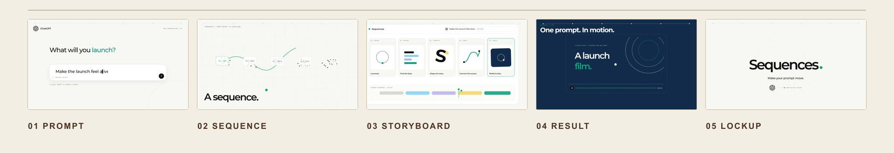
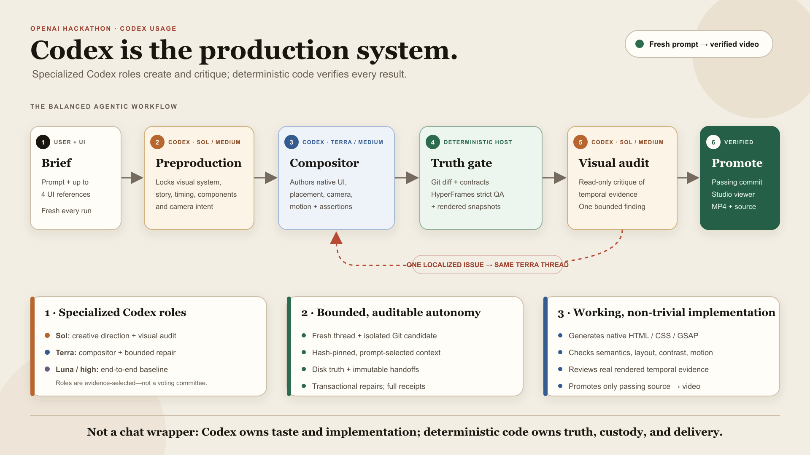

# Sequences

> One prompt becomes a finished SaaS launch video.

Sequences is a Codex-powered motion director for product teams. Give it a short
brief and, if useful, a few UI screenshots. It creates a fresh 20-30 second
product film, shows what it is doing, checks the real result, and places a
passing video in a simple viewer.

The current hackathon build is intentionally focused: **prompt, generate,
watch, and render**. It is a complete watch-only experience, not a half-built
video editor.



_Five moments from the Sequences abstract launch film. The included ChatGPT
showcase is also ready to watch when the app starts._

The five films under `Showcase/` were made through the Sequences pipeline using
Codex and the pinned HyperFrames skills. They are retained as finished examples
and bounded craft references for new generations.

## Contributors

- **Vladimir Hegai** — creator, product direction, design, and creative review.
- **Codex by OpenAI (GPT-5.6)** — AI co-builder across implementation,
  debugging, live QA, and documentation.

## Why Sequences

Good launch videos are expensive in two ways: they need strong creative taste,
and they need careful motion-design work. Small SaaS teams often have neither a
motion designer nor days to spend inside a timeline.

Sequences gives that team a small creative production crew:

- **Sol** directs the story and reviews the finished work.
- **Terra** builds the product UI, camera moves, and animation.
- **Luna** is the all-in-one benchmark that can direct and build a full video.
- **Sequences** checks the real output and only delivers work that passes.

This is different from filling a template. Each Generate starts a new product
story and a new native HyperFrames composition.

## At a glance

| Judging area                     | Evidence in this project                                                                                                                                                                                          |
| -------------------------------- | ----------------------------------------------------------------------------------------------------------------------------------------------------------------------------------------------------------------- |
| **Technological implementation** | GPT-5.6 creates real HTML, CSS, and GSAP motion. Typed contracts, isolated Git candidates, browser-based QA, bounded repair, receipts, and verified rendering make it a working system rather than a prompt demo. |
| **Design**                       | One clear page contains the video viewer, prompt, live progress, Showcase, and Recent results. The prepared sample and generated videos are playable with familiar controls.                                      |
| **Potential impact**             | Founders, product marketers, and designers can turn a brief and product screenshots into a launch film without first becoming motion-design experts.                                                              |
| **Quality of the idea**          | Codex owns creative judgment while deterministic code owns truth. A second Codex role reviews painted frames, not just text or source code.                                                                       |

## Run locally

### Prerequisites

The hackathon build is tested on Windows. Install:

- [Bun](https://bun.sh/) 1.3 or newer
- [Node.js](https://nodejs.org/) 22 or newer
- [Git](https://git-scm.com/)
- [FFmpeg](https://ffmpeg.org/) with `ffprobe` on `PATH`
- an installed and authenticated [Codex CLI](https://developers.openai.com/codex/cli)

Check Codex authentication with:

```powershell
codex login status
```

### Install and verify

```powershell
git clone https://github.com/vladimirhegai/Sequences_OpenAi.git
cd Sequences_OpenAi
bun install
bun run judge
```

`bun run judge` is the best first check. It verifies the local tools, pinned
HyperFrames version, skill bundle, build, server session, and prepared sample.
It does not spend a model generation.

No `.env` file is required for the default path. Copy `.env.example` only when
you want to test a different model route or port.

### Start the app

```powershell
bun run dev
```

Open the exact `http://127.0.0.1:4317/?boot=...` URL printed by the server. The
boot value is a short-lived local session token, so do not remove it.

The prepared ChatGPT showcase loads immediately. A judge can inspect the full
product without waiting for a new generation. Generating a new video requires
the authenticated Codex CLI and normally takes several minutes.

## Use the product

1. Enter a plain-language launch-video brief.
2. Optionally attach up to four PNG, JPEG, or WebP product screenshots.
3. Click **Generate**.
4. Follow the timer and live stage updates while Codex works.
5. Watch the verified result in the player.
6. Start a render and download the MP4 and exact source bundle.

Every Generate is fresh. It never continues an old thread or edits the video
that is already playing. If a run fails, the previous good video stays
available.

## How Codex and GPT-5.6 are used



The production default is a small specialist workflow, not a group vote:

1. **Sol / medium - creative director.** Sol chooses the story, look, pacing,
   product moments, component states, camera direction, and sound plan.
2. **Terra / medium - motion designer and builder.** Terra turns that locked
   plan into the real HyperFrames video: UI, layout, transitions, camera, and
   animation.
3. **Sequences - truth gate.** The host checks the actual files and browser
   output. It tests the story contract, readable layout, contrast, motion, and
   important frames.
4. **Sol / medium - final reviewer.** Sol sees ordered screenshots from the
   finished video. It can pass the work or describe one focused improvement.
5. **Terra / medium - bounded repair.** If needed, the exact same Terra thread
   gets one focused polish task. Every check then runs again.
6. **Luna / high - all-in-one baseline.** Luna remains the controlled baseline
   for directing and building the whole film in one Codex thread. Repeated live
   tests, not guesswork, led to the current Sol/Terra split.

GPT-5.6 is doing more than writing copy. Inside the product it:

- studies uploaded UI references;
- creates the visual direction and causal product story;
- plans reusable UI components and their visible states;
- chooses transitions, camera moves, pacing, and audio cues;
- writes the renderable motion-design source;
- reviews real frames from the completed video; and
- repairs a specific problem without restarting the run.

### How the system keeps agents honest

- Each run gets a fresh thread and isolated Git candidate, and its creative plan
  is locked before implementation begins.
- Completion comes from the files and Git diff, not an agent saying "done."
- A hash-pinned skill profile gives each role only relevant HyperFrames and
  SaaS-launch guidance.
- Repairs are kept only when they improve the result without breaking another
  check. Every turn records its role, route, time, tokens, and result.

## How Codex contributed to building Sequences

Codex was used throughout the hackathon development process. It helped:

- turn lessons from the old Slack prototype into a smaller, fresh architecture;
- build the React product UI and Bun/Hono orchestration server;
- create the typed story, design, component, camera, motion, and audio contracts;
- implement isolated candidate worktrees and automatic promotion;
- connect the pinned HyperFrames player, quality checks, and renderer;
- verify the real website, inspect rendered frames, and turn observations into
  regression tests;
- replace one-off fixes with regression tests and shared safeguards; and
- design and test the Sol/Terra/Sol workflow while keeping Luna as a baseline.

The human product owner stayed the source of truth for scope and taste. Codex
handled implementation, diagnosis, testing, and repeated refinement. The dated
commit history is the main public evidence. Per-generation diagnostics stay
local under `data/` and are excluded from the repository.

## What makes the implementation non-trivial

| Layer                   | What is implemented                                                                                                                               |
| ----------------------- | ------------------------------------------------------------------------------------------------------------------------------------------------- |
| **Creative handoff**    | `frame.md`, a design capsule, `sequence.json`, and a typed component plan describe the intended film before render code is written.               |
| **Native video source** | The result is ordinary HTML, CSS, local assets, and seek-safe GSAP motion. There is no hidden second renderer or prerecorded generation.          |
| **Quality control**     | HyperFrames lint and strict browser checks cover runtime errors, assets, timing, layout, contrast, transitions, and motion assertions.            |
| **Safe autonomy**       | Codex works in a disposable Git candidate. Only allowed files can be promoted, and protected skills are hash-checked before and after authoring.  |
| **Focused repair**      | Contract, layout, QA, and visual-audit findings return to the exact source-owning thread with a small repair budget.                              |
| **Delivery**            | The host promotes the passing commit, renders it, checks the MP4 with `ffprobe` and decoded boundary frames, and exposes the MP4 plus source ZIP. |

HyperFrames owns the HTML video runtime, player, QA primitives, and rendering.
Sequences owns creative direction, semantic contracts, verification custody,
evidence, the product UI, and delivery.

## Test it

All offline tests use included fixtures and temporary directories. They do not
need paid model calls.

| Command                   | Purpose                                                                                        |
| ------------------------- | ---------------------------------------------------------------------------------------------- |
| `bun run judge`           | Best judge smoke test: tools, build, server, session, skills, HyperFrames, and prepared sample |
| `bun run typecheck`       | TypeScript contracts                                                                           |
| `bun run test`            | Unit, policy, orchestration, QA, render, and client tests                                      |
| `bun run build`           | Production web build                                                                           |
| `bun run qa:fixture`      | Pinned HyperFrames lint and strict browser QA on the sample film                               |
| `bun run test:phase -- 0` | Foundation, security, promotion, render, and download gate                                     |
| `bun run test:phase -- 1` | Fresh-generation, semantic-contract, repair, and Studio gate                                   |
| `bun run test:all`        | Full local exit gate                                                                           |

With `bun run dev` already running, check the real website without submitting a
model run:

```powershell
bun run probe:website -- --check-ui
```

Run a literal website generation through the same prompt box and Generate
button a user clicks:

```powershell
bun run probe:website -- --image .\path\ui.png "Launch our new AI search feature"
```

The included test and sample data lives in:

- `fixtures/release-a/` - known-good project and strict-QA fixture;
- `fixtures/saas-shell/` - neutral starter copied into each fresh candidate;
- `Showcase/` - Sequences-made films, source, contact sheets, and QA evidence;
- `demos/` - compact motion-grammar examples referenced by the pinned skills;
  and
- `.agents/` - the hash-pinned Codex skill profile and registry snapshot.

## Project map

```text
apps/web/          React product + Bun/Hono server
fixtures/          prepared sample and fresh SaaS starter
Showcase/          finished reference films and evidence
demos/             compact motion-grammar examples used by the skills
.agents/           pinned Codex/HyperFrames skills
vendor/hyperframes pinned third-party reference source
vendor/audio/      temporary Build Week audio, hashes, and notice
scripts/           setup, doctor, tests, probes, QA, and render commands
```

Generated runs, candidates, logs, and renders live under `data/` and
`artifacts/`. They are local evidence and are not committed.

## Third-party tools and media

- [HyperFrames 0.7.56](https://github.com/heygen-com/hyperframes) by HeyGen is
  the video composition, player, QA, and rendering foundation. It is used under
  the [Apache 2.0 license](vendor/hyperframes/LICENSE). Sequences uses the
  framework directly and does not embed HyperFrames Studio.
- [GSAP 3.13](https://gsap.com/) provides seek-safe DOM animation under its
  published standard license.
- React, Hono, Zod, Vite, Vitest, Puppeteer, Bun, and FFmpeg are standard tools
  used under their applicable licenses. Exact package versions are pinned in
  `package.json` and `bun.lock`.
- **Sound effects:** selected from [Freesound](https://freesound.org/), where
  every sound has its own Creative Commons license.
- **Background music:** provided by
  [Fesliyan Studios](https://www.fesliyanstudios.com/) and covered for the
  submitted Sequences demo by a commercial-use license purchased on July 21, 2026. [View the license terms](https://www.fesliyanstudios.com/license/?id=2ec92aa4-5cd7-4951-91e3-02521e9635fa).
  These tracks are not open-source assets and will be replaced before an
  open-source release. See [`vendor/audio/NOTICE.md`](vendor/audio/NOTICE.md).

## Current scope

- The Studio is watch-only. Editing, revision prompts, Apply/Reject controls,
  and a full NLE timeline are later work.
- New generations require an authenticated Codex CLI and can be affected by
  model capacity.
- The local hackathon path is tested on Windows and binds only to loopback.
- Website URL capture, multi-project management, and collaboration are outside
  this focused build.

For deeper technical detail, see [`ARCHITECTURE.md`](ARCHITECTURE.md).

## Hackathon project boundary: prior work vs. new work

**Sequences for Slack was the research basis, not this codebase.** It existed
before the hackathon and finished its last development work on July 13, 2026.
It was a Slack/Bolt application with a Railway worker, a different orchestration
system, persistent creative threads, and HyperFrames 0.6.86.

This repository is a **new, ground-up implementation** created during the
hackathon in a separate Git history:

| Before the hackathon: Slack Sequences                 | Built during the hackathon: this repository                                     |
| ----------------------------------------------------- | ------------------------------------------------------------------------------- |
| Slack commands and thread replies                     | A new editorial React web product                                               |
| Slack OAuth, hosted MCP, and Railway worker           | A local Bun/Hono host with no Slack dependency                                  |
| Persistent Luna route and an older committee fallback | Fresh-run Sol/Terra/Sol workflow with Luna as a measured baseline               |
| HyperFrames 0.6.86 and a custom Slack delivery engine | Pinned HyperFrames 0.7.56, native player, strict QA, and host-owned render      |
| Pre-hackathon research prototype                      | Smaller isolated candidates, typed contracts, bounded repair, and focused tests |

No Slack application, Slack authentication, old worker, or legacy committee
runs inside this project. What carried forward was product learning: the model
should own taste, the host should own truth, and motion quality must be judged
from real frames. The older Slack launch film is included only as a clearly
labeled Showcase craft reference; it is not the current application or a
starter copied into generated videos.

### Dated evidence

- July 14, 2026: [starting documents commit](https://github.com/vladimirhegai/Sequences_OpenAi/commit/2bc5ef3d4e8a872eb5361c6c220b4fcd7803e953)
  records the clean repository boundary before implementation.
- July 14, 2026: [first implementation commit](https://github.com/vladimirhegai/Sequences_OpenAi/commit/f689e74f461b594af54d3c4949b999733f8b56a6)
  adds the new web app, server, contracts, fixtures, tests, and HyperFrames-native
  foundation from scratch.
- July 21, 2026: [public Build Week milestone](https://github.com/vladimirhegai/Sequences_OpenAi/commit/b6553f02fffe0cb41c3d6a826410181730ecfdce)
  records the expanded GPT-5.6 workflow, product UI, QA, audio, Showcases, and
  release evidence.
- The full dated [commit history](https://github.com/vladimirhegai/Sequences_OpenAi/commits/main/)
  shows the Codex-assisted implementation and refinement of the judge-ready
  product path.

This distinction is deliberate: the old project proved the need. **This
hackathon project rebuilt the product around one prompt, specialized GPT-5.6
roles, deterministic verification, and a judge-ready web experience.**
