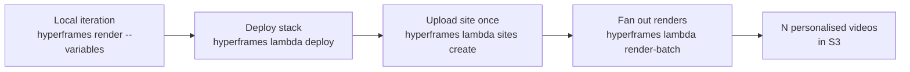

HyperFrames templates are compositions that take typed variables — a name, a colour, a chart payload, a CTA URL — and produce a finished render parameterised by those values. Pair a template with the deployed Lambda stack and `lambda render-batch`, and you get personalised-video-at-scale in one CLI call:

```bash
hyperframes lambda render-batch ./my-template \
  --batch ./users.jsonl \
  --width 1920 --height 1080
```

This guide walks the full loop: declare variables on a composition, iterate locally with `hyperframes render`, deploy to Lambda once, then fan out N renders from a batch file. The same flow also drives single personalised renders via `lambda render --variables` and programmatic batches via `renderToLambda({ variables })`.



## What's a template

A template is just a HyperFrames composition whose top-level HTML element declares a `data-composition-variables` attribute listing the variables it accepts. The composition reads the runtime values via `window.__hyperframes.getVariables()`.

```html
<!doctype html>
<html
  data-composition-variables='[
    {"id":"title","type":"string","label":"Headline","default":"Welcome"},
    {"id":"accentColor","type":"string","label":"Accent","default":"#0a0a0a"},
    {"id":"avatarUrl","type":"string","label":"Avatar image","default":"/avatars/default.png"}
  ]'
>
<head><meta charset="utf-8"><title>Welcome template</title></head>
<body style="margin:0;background:#f6f5f1">
  <div data-composition-id="root" data-width="1920" data-height="1080" data-duration="5">
    <h1 id="title" style="font:80px Inter,sans-serif">Welcome</h1>
    <div id="accent" style="width:100%;height:8px"></div>
    
  </div>
  <script>
    (function () {
      var v = window.__hyperframes.getVariables();
      document.getElementById("title").textContent = v.title;
      document.getElementById("accent").style.background = v.accentColor;
      document.getElementById("avatar").src = v.avatarUrl;
    })();
  </script>
</body>
</html>
```

The runtime helper is exposed as a global — `window.__hyperframes.getVariables()` — not as a fetchable module. Use a plain `<script>` (not `<script type="module">`) so the runtime is already initialized when the script executes.

## Declaring variables

Each entry in the `data-composition-variables` array describes one variable. Supported shapes:

| Field | Required | Example |
|-------|----------|---------|
| `id` | yes | `"title"` |
| `type` | yes | `"string"`, `"number"`, `"color"`, `"boolean"`, `"enum"` |
| `label` | recommended | `"Headline"` |
| `default` | recommended | `"Welcome"` |

See [Variables](/concepts/variables) for the per-type editor widgets and the `"enum"`-only `options` field.

`getVariables()` returns the merged result of declared defaults and any caller overrides, so a composition with sensible defaults renders unchanged in preview mode and in production. Render-time overrides come from `--variables '{...}'` on the CLI or the `variables` field on the SDK's `renderToLambda` call.

Variables are typed primitives; for structured data (a list of bullets, a nested record), serialise it on the caller side and parse it back inside the composition:

```html
<html data-composition-variables='[
  {"id":"heroJson","type":"string","label":"Hero copy (JSON)","default":"{\"title\":\"Hi\"}"}
]'>
```

The runtime won't accept declaration `type: "object"` — the parser rejects anything outside the five canonical types and silently drops the declaration, so `--strict-variables` would then flag every key as undeclared.

## Local iteration loop

Fast iteration is the whole point of templates — you should not have to deploy to Lambda to see how a value looks. Use `hyperframes render` locally with `--variables` (or `--variables-file`) to render the template against any payload:

```bash
hyperframes render --variables '{"title":"Hello Alice","accentColor":"#ff0000"}' \
  --output renders/alice-preview.mp4
```

Pass `--strict-variables` to fail on type mismatches against the `data-composition-variables` declaration. Without the flag, mismatches print as warnings and the render continues.

```bash
hyperframes render --variables-file ./alice.json --strict-variables \
  --output renders/alice-preview.mp4
```

## Deploying to Lambda

Templates render on the standard `hyperframes lambda` stack — there's no special template-only deployment. Run:

```bash
hyperframes lambda deploy
```

once per AWS account/region. The [aws-lambda deploy guide](/deploy/aws-lambda) covers the SAM stack, IAM policies, and the CloudFormation outputs.

When the same template will produce many renders, upload the project once with `lambda sites create` and reference its content-addressed `siteId` from every subsequent render or batch:

```bash
hyperframes lambda sites create ./my-template
# → Site ID: abc1234deadbeef0
```

## Single personalised render

For one-off renders, pass `--site-id` + per-render `--variables`. The CLI synthesises the minimal site handle from the `siteId` (no re-tarring) and invokes `renderToLambda`:

```bash
hyperframes lambda render ./my-template \
  --site-id abc1234deadbeef0 \
  --width 1920 --height 1080 \
  --variables '{"title":"Hello Alice","accentColor":"#ff0000"}' \
  --output-key renders/alice.mp4 \
  --wait
```

`--wait` streams progress lines until the render finishes; without it the CLI returns immediately and you poll via `hyperframes lambda progress <renderId>`.

## Batch pipeline (the headline)

`lambda render-batch` is the headline ergonomic: one CLI call dispatches N personalised renders. Author a JSONL file with one entry per recipient:

```jsonl
{"outputKey": "renders/alice.mp4", "variables": {"title": "Hi Alice", "accentColor": "#ff0000"}}
{"outputKey": "renders/bob.mp4",   "variables": {"title": "Hi Bob",   "accentColor": "#00aa00"}}
{"outputKey": "renders/carol.mp4", "variables": {"title": "Hi Carol", "accentColor": "#0000ff"}}
{"outputKey": "renders/dave.mp4",  "variables": {"title": "Hi Dave",  "accentColor": "#ff00aa"}}
{"outputKey": "renders/erin.mp4",  "variables": {"title": "Hi Erin",  "accentColor": "#aa00ff"}}
```

Run the batch:

```bash
hyperframes lambda render-batch ./my-template \
  --batch ./users.jsonl \
  --width 1920 --height 1080 \
  --max-concurrent 5
```

The verb deploys the site once (or skips with `--site-id`), then calls `renderToLambda` per row. Variables travel inline in each JSONL entry — `render-batch` does not accept `--variables-file` because per-entry payloads are the whole point. Concurrent Step Functions starts are capped at `--max-concurrent` (default 50) so a 10 000-entry batch doesn't try to spawn 10 000 executions simultaneously and trip the AWS account's concurrent-execution limit.

The manifest output gives one row per input line:

```
Batch dispatched: 5 started, 0 failed-to-start.

  ✓ line 1  renders/alice.mp4  arn:aws:states:us-east-1:1234:execution:hf:hf-render-...
  ✓ line 2  renders/bob.mp4    arn:aws:states:us-east-1:1234:execution:hf:hf-render-...
  ✓ line 3  renders/carol.mp4  arn:aws:states:us-east-1:1234:execution:hf:hf-render-...
  ✓ line 4  renders/dave.mp4   arn:aws:states:us-east-1:1234:execution:hf:hf-render-...
  ✓ line 5  renders/erin.mp4   arn:aws:states:us-east-1:1234:execution:hf:hf-render-...
```

Add `--json` for the machine-readable form your batch coordinator can pipe to `jq`:

```bash
hyperframes lambda render-batch ./my-template --batch ./users.jsonl \
  --width 1920 --height 1080 --json \
  | jq -r '.[] | select(.status == "started") | .executionArn'
```

Poll each `executionArn` (or `renderId`) with `lambda progress` to track completions:

```bash
hyperframes lambda progress arn:aws:states:us-east-1:1234:execution:hf:hf-render-abcd
```

Use `--dry-run` to lint a batch file before paying for any executions. Every entry's status becomes `would-invoke`:

```bash
hyperframes lambda render-batch ./my-template --batch ./users.jsonl \
  --width 1920 --height 1080 --dry-run --json
```

## Programmatic via SDK

The same surface is available from TypeScript via `@hyperframes/aws-lambda/sdk`. Deploy the site once and parallel-render the batch:

```typescript
import { deploySite, renderToLambda } from "@hyperframes/aws-lambda/sdk";

const users = [
  { name: "Alice", accentColor: "#ff0000" },
  { name: "Bob",   accentColor: "#00aa00" },
  // … 1 000 more rows …
];

const siteHandle = await deploySite({
  projectDir: "./my-template",
  bucketName: process.env.HYPERFRAMES_BUCKET!,
});

const handles = await Promise.all(
  users.map((user) =>
    renderToLambda({
      siteHandle,
      bucketName: process.env.HYPERFRAMES_BUCKET!,
      stateMachineArn: process.env.HYPERFRAMES_SFN_ARN!,
      config: {
        fps: 30,
        width: 1920,
        height: 1080,
        format: "mp4",
        variables: { title: `Hello ${user.name}`, accentColor: user.accentColor },
      },
      outputKey: `renders/${user.name.toLowerCase()}.mp4`,
    }),
  ),
);

console.log(`Started ${handles.length} renders`);
```

`HYPERFRAMES_BUCKET` and `HYPERFRAMES_SFN_ARN` come from the deployed stack. `hyperframes lambda deploy` prints them as `RenderBucketName` and `RenderStateMachineArn`, and they're also available via `aws cloudformation describe-stacks --query "Stacks[0].Outputs"`. See the [aws-lambda deploy guide](/deploy/aws-lambda) for the full CloudFormation outputs table.

Wrap the `Promise.all` in a semaphore (or use the CLI's `runWithConcurrencyLimit` pattern) when the batch is large enough that an unbounded burst would trip your AWS Lambda concurrent-execution quota.

## Working with large variables

Variables travel inside the Step Functions Standard execution input, which AWS caps at **256 KiB for the entire input** (not just the variables — the cap is on the full serialised payload). Express workflows cap at 32 KiB; we use Standard for execution-history visibility, so 256 KiB applies.

The SDK validates the size client-side and rejects oversize inputs with a clear error before any AWS call:

```
[validateConfig] config: Step Functions execution input is 287422 bytes,
which exceeds the 262144-byte (256 KiB) limit for Standard workflows.
Variables are for typed data (strings, numbers, structured records);
media assets (images, audio, video) should be passed as URL references
the composition resolves at render time, not inlined as base64. See
https://hyperframes.heygen.com/deploy/templates-on-lambda#working-with-large-variables
for the URL-your-assets convention.
```

**The convention: variables are for typed data; media assets are URL references the composition resolves at render time.**

Right:

```json
{
  "title": "Hello Alice",
  "accentColor": "#ff0000",
  "avatarUrl": "https://cdn.example.com/avatars/alice.png"
}
```

Wrong (will explode for any non-trivial image):

```json
{
  "title": "Hello Alice",
  "avatarBase64": "data:image/png;base64,iVBORw0KGgoAAAANSUh..."
}
```

In the composition, the script that wires variables into the DOM uses the URL directly — the Lambda chunk worker fetches the asset over the file server during capture, the same way it would on the local renderer:

```html
<script>
  (function () {
    var v = window.__hyperframes.getVariables();
    document.getElementById("avatar").src = v.avatarUrl;
  })();
</script>
```

The same constraint applies to Remotion's `inputProps` — if you're migrating from `@remotion/lambda`, your payloads should already be structured this way.

If your typed-data payload genuinely exceeds 256 KiB (e.g. a long structured record per render with no media), [file an issue](https://github.com/heygen-com/hyperframes/issues/new) — there's a clean path via S3-hosted variable files, but we want to see real demand before designing the API.

## Cost and scale

Each personalised render is one Step Functions execution + N chunk Lambda invocations. At default settings (`chunkSize: 240`, `maxParallelChunks: 16`) a 5-second 30fps composition is 1 chunk; a 60-second composition is ~8 chunks.

The cost knobs:

- **`--max-parallel-chunks`**: per render, default 16. Smaller compositions don't fan out beyond `ceil(totalFrames / chunkSize)`. Higher values pay more Lambda invocations but finish faster.
- **`--target-chunk-frames`**: optional per-chunk frame ceiling. With the default count-based sizing, a long composition's chunks grow with its length (`maxParallelChunks` chunks of `ceil(totalFrames / maxParallelChunks)` frames each), so a long enough render produces chunks too big to finish inside Lambda's 15-min cap. Setting this caps frames per chunk — the planner uses `clamp(ceil(totalFrames / targetChunkFrames), 1, maxParallelChunks)` chunks, adding chunks on long videos to keep each under the bound while still collapsing short videos to fewer chunks. It's a ceiling, not a fixed size, and is ignored when `--chunk-size` is set. A render long enough to need more than `maxParallelChunks` chunks stays at the cap (chunks then exceed the target — raise `--max-parallel-chunks` or shorten the render).
- **Lambda reserved concurrency** (`lambda deploy --concurrency=<N>`): caps how many Lambda invocations the render function can run in parallel. Other workloads in the same AWS account share the same account-level concurrency pool (~1 000 in most regions by default), so reserved concurrency keeps the render function from starving them and vice-versa.
- **`render-batch --max-concurrent`**: orchestrator-side. Caps how many `StartExecution` calls run simultaneously — distinct from the Lambda concurrency cap, which lives one level below at the chunk-invoke layer. The CLI cannot enforce Lambda's account limit; it can only avoid creating excess Step Functions executions queued against it.
- **Lambda memory** (`lambda deploy --memory`): default 10 240 MB (max). Higher memory buys faster Chrome capture + more vCPUs per chunk; lower memory saves cost but risks `15 min` timeouts on heavy compositions.

Each Step Functions execution fans out to ~`maxParallelChunks` Lambda invocations. So if the deployed reserved concurrency is 8 and `maxParallelChunks` stays at the 16 default, even a single render will get throttled — bump the deploy concurrency before running large batches.

For small batches (< 100 entries) the default `--max-concurrent 50` is fine. For large batches (> 1 000), a useful starting point is `--max-concurrent ≈ floor(reservedConcurrency / maxParallelChunks)` so each running render gets its full chunk fan-out budget; the batch verb does NOT enforce this, it's just guidance for picking the flag value.

In-process vs distributed crossover: for a single render under ~30 seconds, the in-process renderer (`hyperframes render`) wins on latency because there's no S3 round-trip per chunk. Distributed wins for renders over ~60 seconds or when you need a personalised batch — that's the whole reason this surface exists. (The Phase 7 small-render shortcut, when it lands, will collapse the gap for short renders.)

## Migrating from @remotion/lambda inputProps

Remotion's `inputProps` API and HyperFrames' `variables` are isomorphic — both are JSON objects injected as render-time overrides on top of declared composition defaults. The mapping is mechanical:

| Remotion | HyperFrames |
|----------|-------------|
| `Composition.defaultProps` | `data-composition-variables` declaration on the root HTML element |
| `useCurrentFrame()` + `props.<x>` | `window.__hyperframes.getVariables().<x>` (read once on DOMContentLoaded) |
| `renderMediaOnLambda({ inputProps })` | `renderToLambda({ config: { variables } })` |
| Lambda inputProps 256 KiB cap | Step Functions execution-input 256 KiB cap |
| inputProps URL'ing pattern for large media | Same convention — URL references, not inlined bytes |

Remotion's `inputProps` has the same 256 KiB constraint and the same "URL your assets" convention, so a migration of a working `inputProps` pipeline is a straightforward CLI/SDK swap, not a payload reshape.

## What's next

- **Smaller batch primitives**: HTML-form input alongside JSONL. Open an issue if you'd find this useful.
- **TypeScript types generated from `data-composition-variables`**: `hyperframes types generate <projectDir>` is sketched and may land in v1.5; it would let SDK callers `import type { Variables } from "./template/variables"` for autocomplete + typecheck.
- **HDR template support**: HDR mp4 is currently distributed-mode-rejected (in-process only). The next v1.5 item is unblocking HDR for distributed renders so templates can produce wide-gamut output.

If your template pipeline hits a wall the docs don't cover, [file an issue on GitHub](https://github.com/heygen-com/hyperframes/issues/new) — the batch surface is new and the feedback loop on it is short.
